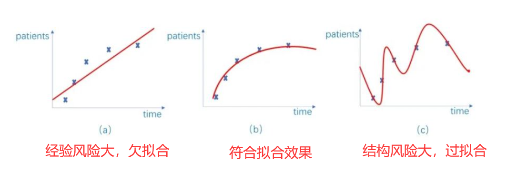
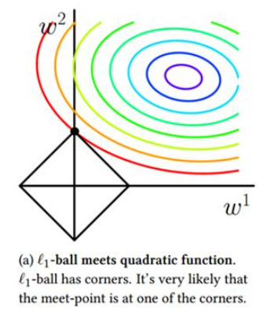
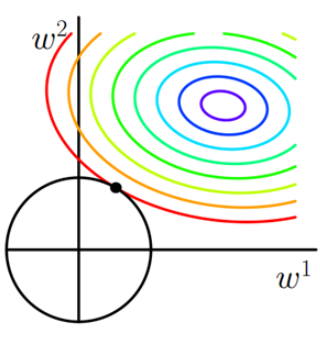

# 正则化
## 定义
&emsp;&emsp;正则化在深度学习的训练中，往往起到一个规范模型结构的作用，比如为了让模型防止发生过拟合，提高泛化能力，我们会通过加入正则项来完成对高次分量的抑制。其中防止过拟合也会被称为减小结构风险。

&emsp;&emsp;[维基百科](https://en.wikipedia.org/wiki/Regularization_(mathematics))中这么定义：在数学、统计学、金融、 计算机科学中，特别是在机器学习和逆问题中，正则化是添加信息以解决不适定问题或防止过度拟合的过程。正则化可以应用于不适定优化问题中的目标函数。正则化项或惩罚项对优化函数施加了成本，以使最优解唯一。

## 范数
&emsp;&emsp;范数的起源是用来比较两个向量之间的大小，比较标量的大小十分容易，比较张量就需要我们将张量以某种形式的计算，变成标量，从而进行比较，范数的作用就是这个可以完成向量到标量计算的函数。
范数的一般化定义如下,对于p范数，其表达式为
$$
||x||_{p} := (\sum_{i=1}^{n}X_{i}^p)^{\frac{1}{p}}
$$
 
&emsp;&emsp;对于一个损失函数，我们可以通过加入范数来完成对其的正则化。$Loss = loss(\hat{y} ,y) + \lambda||w||_{p}$

**L1范数**
 即当p=1时，注意这时的范数其表示某个向量中所有元素绝对值的和。
 如果将L1范数引入到损失函数中，在减小Loss函数时，也会减小$||w||_{p}$的值，在L1范数在对于每一个方向（$w_{i}$）求导数，都可以获得向0点方向1的梯度。所以$w_{i}$会去向于0，而在$w_{i}=0$时又不可导，所以会使得被正则化的$w$项出现较多的0点，也就是业界长说的稀疏化了，这里放上一张今典的图片，下图中黑色框所包围的区域表示了一个L1范数可以接收的区域；，我们要在这个区域中找到使得模型$loss$函数（彩色线展现了它的梯度分布）能取得最小值的点。可以看到，是有较大的概率取到坐标轴上的，也就是有$w_{i}$的值为0。

**L2范数**
 当p=2时，是L2范数， 表示某个向量中所有元素平方和再开方， 也就是欧几里得距离公式。和L1参数类似，只不过L2参数更加缓和，它的作用是使得被正则化的参数$w$尽可能的小，因为大的$w$被认为会导致过拟合，影响模型的稳定性。可以设想，如果参数$w$很大，在我们输入的x有稍微的变化时，输出就会有很大的变化，这样的模型缺乏稳定性。下图展现了L2范数在$w$为2维时的接收区域，这时就没有L1范数那么容易取到$w_{i}=0$的情况了。

