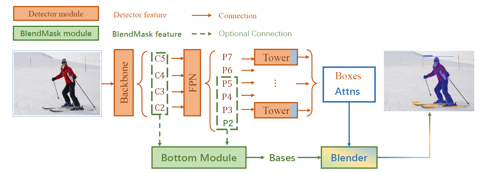
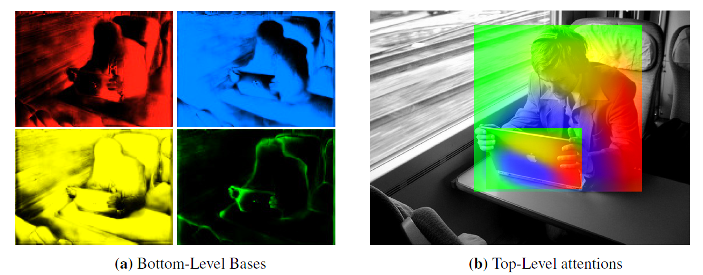
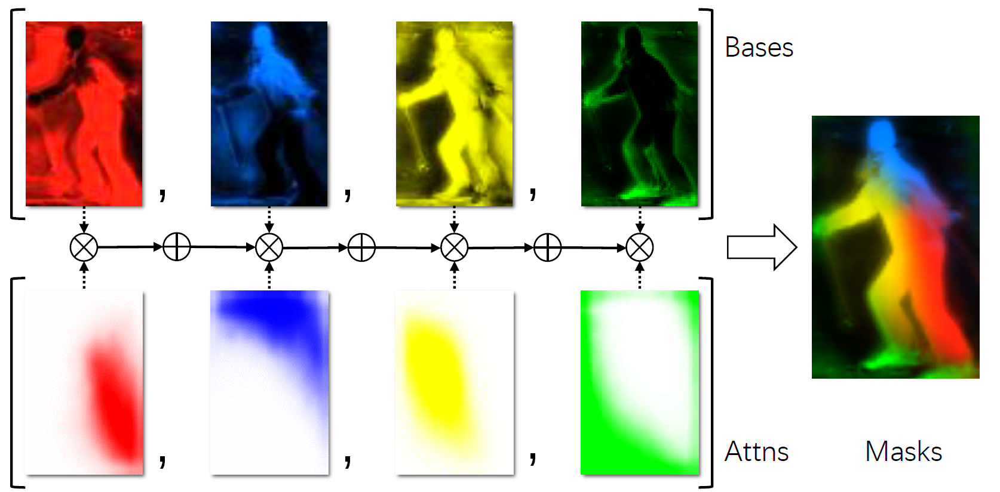

# 【实例分割】Semantic Instance Segmentation via Deep Metric Learning

## 信息
文章链接：[https://arxiv.org/abs/1703.10277](https://arxiv.org/abs/1703.10277)

## 创新点简介
本文使用先计算出两个像素属于同一个目标的可能性后再聚类的方式，完成实例分割任务。`【论文原句】first computing how likely two pixels are to belong to the same object, and then by grouping similar pixels together`。具体来说论文使用全卷积的模型计算出相似度矩阵，然后通过“种子点”聚类相似像素。这些 “种子点” 是由一个全卷积网络训练出来的。

## 详细内容
### 模型结构

上文所说的低层信息，就是这里从骨干和FPN输出中提取出来的`Bases`，而所谓高层特征则是通过了一个个又通过了Tower之后又经过`Boxes Attns`模块的信息，他们通过Blender进行相乘，然后相加融合，最终的输出。 

这里左图对`Bases`进行了可视化，而右图对`Boxes Attns`结果进行了可视化，将对应颜色的`attention` 和 `Base`进行相乘，让后相加就可以得到最后结果。 

### 训练与评估
训练时，通过标签的边界框就可以完成对于每一个实例的区分，而对于评估过程，作者使用FCOS 的预测结果。