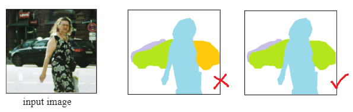
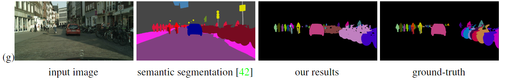

# SGN

## 信息

文章标题：SGN: Sequential Grouping Networks for Instance Segmentation
文章链接：[https://link.springer.com/chapter/10.1007/978-3-319-46466-4_32](https://link.springer.com/chapter/10.1007/978-3-319-46466-4_32)

## 背景

1. 绝大多数的实力分割模型都是 “两阶段” 的，也就是先进行目标检测，再进行语义分割。也有使用了多边形边界`polygon`的方法进行实例分割的，这种方法无法对中空实例进行正确分割。

2. 很多自下而上的网络无法完成对遮挡对象进行正确的分割。

## 创新点简介
本文提出了序列分组网络(SGN)来解决对象实例的分割问题。先训练分类网络，将每个像素分为了前景，背景，是否是边缘，对于边缘节点，又被分为了上下左右四种边沿，之后进行每一行，每一列的分割，得到线段分割`line segments`, 通过无记忆循环网络`LineNet`来聚合线段分割成为个体，最后使用MergerNet来将出现不连续的实例进行聚合。

## 问题

使用Merging 方法会将相似的对象组合到一起。
