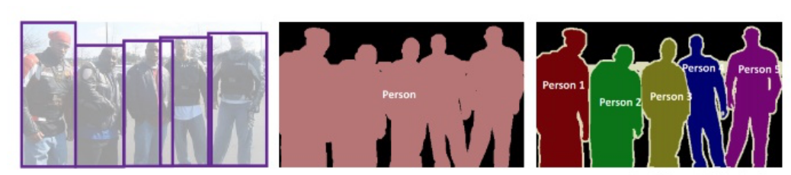

# 基础

## 实例分割和语义分割
1. 能否完全使用语义分割？

   不行，由于目标数目不固定，不能让一个实例就是一个类别。一般思路是先进行目标检测，后对检测狂内的物体进行语义分割，判断检测框内语义分割结果与哪个实例掩膜最接近就认为是哪实例。

2. 存在的问题：两个实例重叠
   
   解决方案1：预测回归框，在回归框里进行二分类。
   
   解决方法2：预测中心，进行聚类。

   
