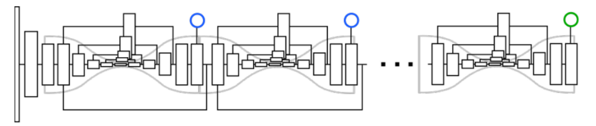

# Associative Embedding

## 信息

文章标题：Associative Embedding: End-to-End Learning for Joint Detection and Grouping

文章链接：[https://proceedings.neurips.cc/paper/2017/hash/8edd72158ccd2a879f79cb2538568fdc-Abstract.html](https://proceedings.neurips.cc/paper/2017/hash/8edd72158ccd2a879f79cb2538568fdc-Abstract.html)

发表时间：2017  (NIPS 2017)

测试数据集： MPII 和 MS-COCO

## 背景
许多计算机视觉任务可以看作是联合的检测和分组，以关键点检测为例，都是检测较小的视觉单元（例如膝盖，手腕，头部），然后再并将它们分组到更大结构中。作者认为种方法可能是次优的, 因为检测和分组通常是紧密耦合的。

## 创新点简介
本文探讨了使用单级深度网络端到端训练的联合执行检测和分组的可能性。提出了一种表示联合检测和分组输出的新方法--联想嵌入。其基本思想是为每一种检测引入一个实数, 作为 "标记" 来标识检测所属的组。换句话说, 标记将每个检测与同一组中的其他检测相关联。并将这种思想扩展到的了实例分割之中。

## 详细内容

### 模型结构

本文 将 “关联嵌入”与“堆叠沙漏网络” 集成在一起, 该网络为每个身体关节生成检测热图和标记热图, 然后将具有相似标记的身体关节分组到个人中。

- 堆叠沙漏模型最初是为单人姿态估计而开发的。该模型为目标人体的每个身体关节提供了一个热图。然后, 将热图激活最高的像素位置作为该关节的预测。这个网络的好处是整合全局和局部特征, 用于收集有关身体完整结构的信息, 同时保留精细细节。
- 

### 损失计算
1. 分组损失：判断相同个体的关键点（较小的视觉单元）是否被分到了同一组内。个体内的标签应该是一样的, 而个体间的标签应该是不一样的。计算出每个关节的预测嵌入与参考嵌入之间的平方距离，在**每对**人之间, 我们将他们的参考嵌入相互比较并施加随着两个标签之间的距离增加呈指数下降到零的惩罚。
2. 检测损失：检测损失计算每个预测检测热图及其真值热图之间的平均平方误差, 该真值热图由每个关键点位置上的二维高斯激活组成。
- $h_k \in R^{W\times H}$ 表示一个个体第k检测点的检测值。
- $h(x)$ 是像素位置x处的输出标签值
- $T=\{(x_{nk})\}$ 表示N和人，K个检测点的真值集合，$x_{nk}$是真值的位置。
- $\overline{h}_n=\frac{1}{K}\sum_kh_k(x_{nk})$ 是一个人上所有检测点的热力图

$$L_g(h,T)=\frac{1}{NK}\sum_n\sum_k(\overline{h}_n - h_k(x_{nk}))^2 + \frac{1}{N^2}\sum_n\sum_{n'}exp\{-\frac{1}{2\sigma^2}(\overline{h}_n - \overline{h}_{n'})\}$$

其中第一项表示检测损失，希望一个目标中的监测点和真值相同，第二项则是让不同的个体特征检测结果尽量的不同。

### 多人姿态估计
设有m个人体关节需要预测, 那么网络将输出总共2m通道, m用于检测和m用于分组。为了将检测解析成个体实例, 我们使用非最大抑制来获取每个关节的峰值检测, 并在相同的像素位置检索其相应的标记 (如图3所示)。然后, 我们通过比较检测的标记值和匹配足够接近的标记值, 对整个人体关节点检测进行分组。而后一组检测形成了一个人的姿势估计。

### 如何扩展到实例分割 
实例分割的目标可以理解为检测到属于对象类的像素, 然后将与单个对象关联的像素组合在一起。

