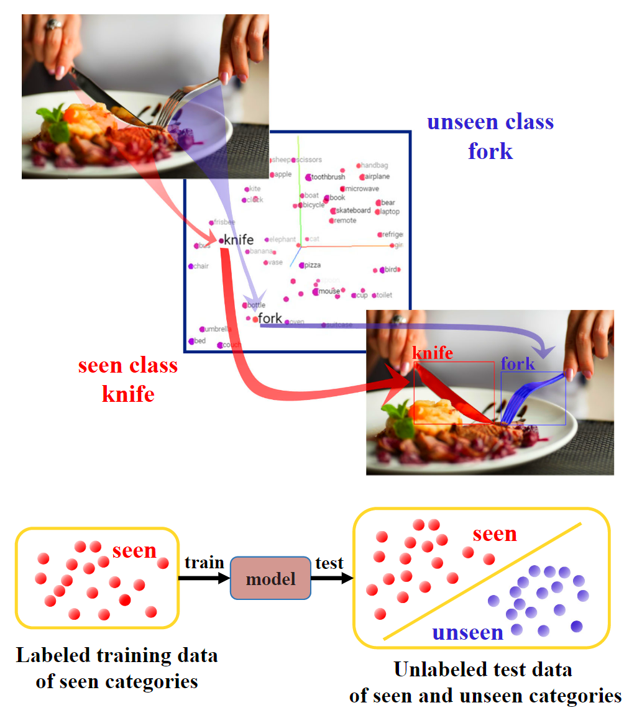

# ZSI

## 信息

文章标题：Zero-Shot Instance Segmentation

文章链接：[https://arxiv.org/abs/2104.06601](https://arxiv.org/abs/2104.06601)

发表时间：2021-04

## 背景

## 创新点简介
通过类间关系，可以推测出没有见过的类。如下图，刀是学习过的，但是叉子没有学习过，它推理出来了。

## 详细内容

### 模型结构

## 引用