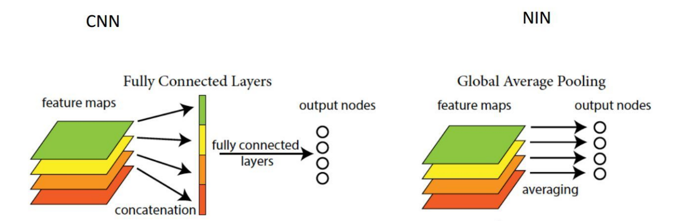

# 全局平均池化 与 类激活图

## 信息

类激活图:[https:://arxiv.org/pdf/1512.04150.pdf](https:://arxiv.org/pdf/1512.04150.pdf)

文章链接：[https:://arxiv.org/pdf/1512.04150.pdf](https:://arxiv.org/pdf/1512.04150.pdf)

发表时间：2015-12

## 背景

## 创新点简介
全连接的出现（左图），让每一个特征图节点和最终的输出节点产生联系，这种联系和注意力机制一样，会产生空间信息的丢失，于是便提出了全局均匀池化的概念，让模型输出某个类的概率之和某一层特征图有关。（使每一层特征输出的均值作为最后结果）

## 详细内容

### 模型结构

## 引用
> although image-level class labels indicate only the exis-tence of object classes, they can be used to derive strongcues for instance segmentation, called Class Attention Maps(CAMs) [37, 43, 45, 49]. A CAM roughly estimates areasof each class by investigating the contribution of local im-age regions to the classification score of the class. How-ever, CAMs cannot be directly utilized as supervision forinstance segmentation since they have limited resolution,often highlight only partial areas of objects, and most im-portantly, cannot distinguish different instances of the sameclass. To resolve this issue, a recent approach [50] incor-porates CAMs with an off-the-shelf segmentation proposaltechnique [2], which however has to be trained separatelyon an external dataset with additional supervision.

[37] M. Oquab, L. Bottou, I. Laptev, and J. Sivic. Is object lo-calization for free? - weakly-supervised learning with con-volutional neural networks. In Proc. IEEE Conference onComputer Vision and Pattern Recognition (CVPR), 2015. 
[43] R. R. Selvaraju, M. Cogswell, A. Das, R. Vedantam,D. Parikh, and D. Batra. Grad-cam: Visual explanationsfrom deep networks via gradient-based localization. In Proc.IEEE Conference on Computer Vision and Pattern Recogni-tion (CVPR), 2017. 
[45] Y. Wei, J. Feng, X. Liang, M.-M. Cheng, Y. Zhao, and S. Yan.Object region mining with adversarial erasing: A simpleclassification to semantic segmentation approach. In Proc.IEEE Conference on Computer Vision and Pattern Recogni-tion (CVPR), 2017. 
[49] B. Zhou, A. Khosla, A. Lapedriza, A. Oliva, and A. Tor-ralba. Learning deep features for discriminative localization.In Proc. IEEE Conference on Computer Vision and PatternRecognition (CVPR), 2016. 