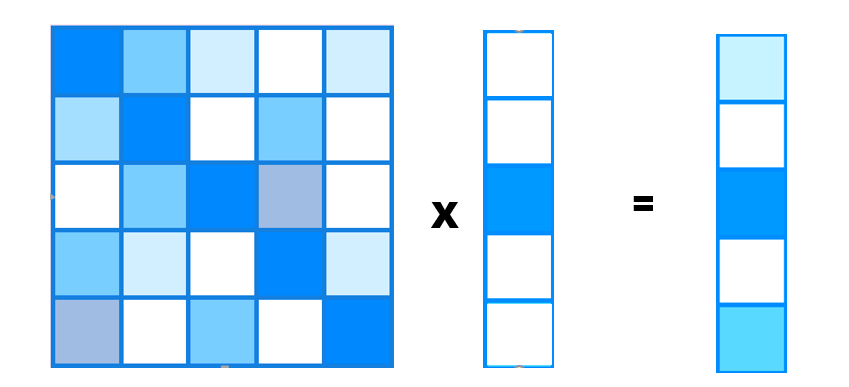

# CRF-RandWalk

## 概率均匀化
【本质】：设计一种概率转移方法，将图像中的密集概率向着整个物品进行扩散。也就是说通过计算两个特征像素之间的相似性，如果相似的话，就让当前像素上的概率和这个像素的概率进行均摊。

## 条件随机场

条件随机场通过“势函数”的引入，将初始的概率图进行转化。
势函数包含了图片的像素色彩和位置信息

## PCM

图片来源于[https://arxiv.org/pdf/2004.04581v1](https://arxiv.org/pdf/2004.04581v1)
PCM通过计算特征之间的相似程度，通过相似程度，进行概率转移。计算方式为余弦相似度。

## 随机游走
状态转移矩阵，类比酒鬼模型。
