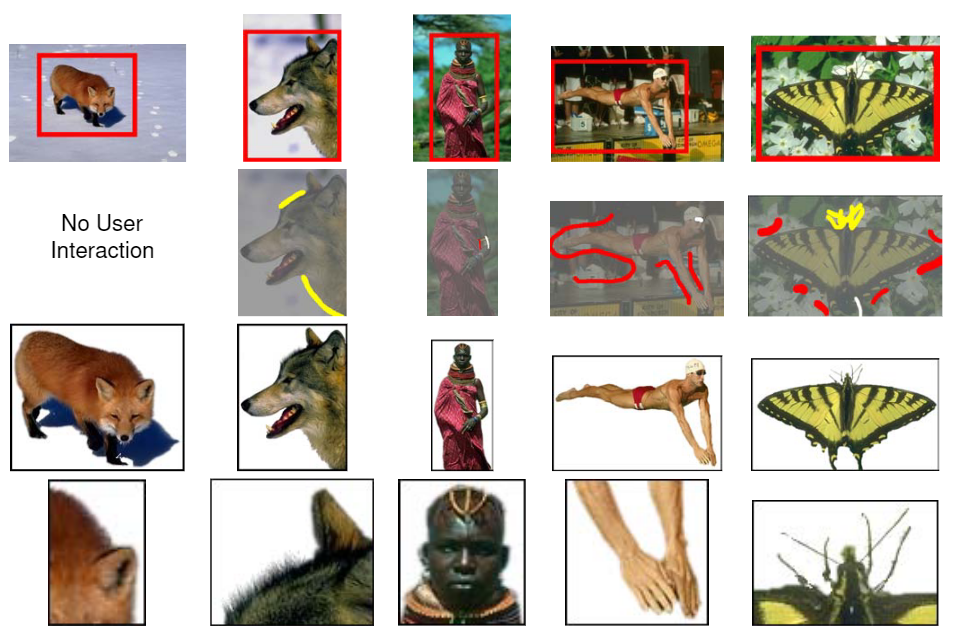

# GraphCut

## 信息

文章标题：Interactive Graph Cuts for Optimal Boundary & Region Segmentation of Objects in N-D Images

文章链接：[https://www.csd.uwo.ca/~yboykov/Papers/iccv01.pdf](https://www.csd.uwo.ca/~yboykov/Papers/iccv01.pdf)

发表时间：2001-07

## 背景

## 创新点简介
用户标记部分像素作为“目标”或“背景”，为图像分割提供硬约束。此外，利用图像的边缘信息和区域信息作为软约束。图割方法是一种全局最优的N维图像分割方法。Graph cuts是一种能量优化算法，应用于前背景分割。它把图像分割问题当作图的最小割（min cut）问题。

## 详细内容

### 模型结构

## 引用