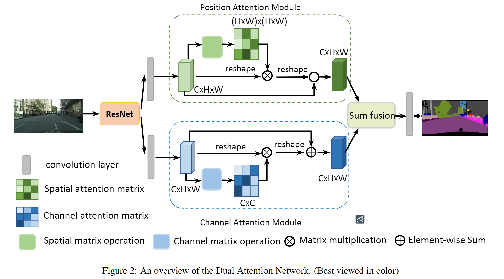
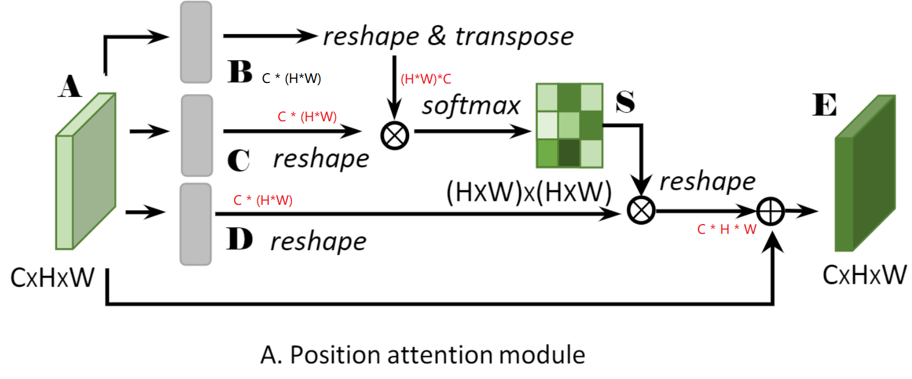
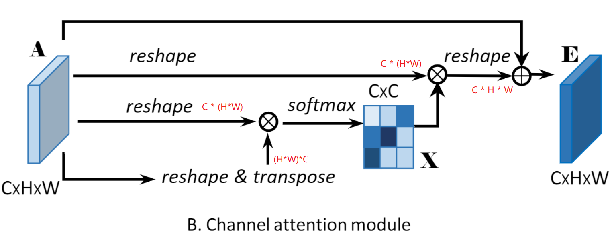

# DANet 

## 基础信息

文章标题：Dual Attention Network for Scene Segmentation

文章链接：[https://arxiv.org/abs/1809.02983](https://arxiv.org/abs/1809.02983)

发表时间：2018-09

## 创新点简介
本文使用自注意力机制，在语义分割上加入了位置自注意力机制和通道自注意力机制，根据作者表述，位置自注意力机制将图片中相似的内容进行互相增强`【原文：any two positions with similar features can contribute mutual improvement regardless of their distance in spatial dimension】`，而通道自注意力机制则可以捕获任意通道之间的互相依赖关系。`【原文：we use the similar self-attention mechanism to capture the channel dependencies between any two channel maps, and update each channel map with a weighted sum of all channel maps】`

## 模型结构
其中灰色细条表示全连接层，绿色区域为位置自注意力模型，蓝色区域为通道自注意力模型，`Sum funsion` 即相加。这里的resnet的最后两层使用了空洞卷积，并且取消了下采样，保留了更多的细节。

对于位置自注意力支路，B支路输出$\mathbb{R}^{(H\times W)\times C}$,C和D支路输出$\mathbb{R}^{C\times (H\times W)}$, BC支路经过矩阵乘法输出结果S，其形状为$(H\times W)\times (H \times W)$,D支路在与输出BC支路输出的位置关系矩阵S相乘，得到形状$C\times (H\times W)$的矩阵，最后reshape 到与输入形状相同的张量。

对于通道自注意力支路，也是类似的操作，要注意的是第一步reshape之后矩阵乘法的顺序是相反的，才能使输出通道之间的关系矩阵。

