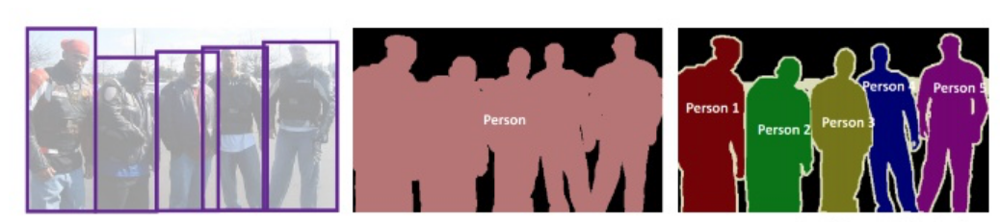

# 基础
语义分割是对图像中的每个像素划分出对应的类别，实现像素级别的分类。实例分割是在语义分割的基础上，进一步分割已划分类别的具体对象，即分割出实例。

## 实例分割算法存在的挑战
引用2016年InstanceCut中的话，实例分割存在着4个问题：
1. 像语义分割一样将每个实例作为一种分类是没有意义的，如“第五个汽车”类。
2. 一张图像中的实例数目差别很大，以城市景观数据集为例，每张图片可能存在0-120个不等的目标实例。 
3. 实例分割相比于目标检测，需要更多的数进行表达，而不是仅仅中心点和长宽，4个值。
4. 实例风格相比语义分割，需要更加细致的标签。

## 实例分割和语义分割
1. 能否完全使用语义分割？

   不行，由于目标数目不固定，不能让一个实例就是一个类别。一般思路是先进行目标检测，后对检测狂内的物体进行语义分割，判断检测框内语义分割结果与哪个实例掩膜最接近就认为是哪实例。

2. 存在的问题：两个实例重叠
   
   解决方案1：预测回归框，在回归框里进行二分类。
   
   解决方法2：预测中心，进行聚类。

## 实例分割可以做的点
> 现阶段语义分割的架构旨在优化分割结果的精确性和提高分割效率。
> 
> 1) 小目标图像实例分割：存在分割准确率低、效果差，还不能完全满足实际应用的要求，存在明显的漏分割、错分割、分割边界模糊等问题。
> 
> 2) 低质量图像实例分割：环境问题：雨天，大雾，夜间，水下环境。设备问题：曝光，移动，景深。
> 
> 3) 轻量化网络架构的需求：在移动端、嵌入式设备的普及应用。
> 
> 4) 遮挡问题：物品之间存在遮挡关系。
> 
> 5) 新型网络架构：新思路的引入：TensorMask将dense的单阶段检测思想融入实例分割，Auto-DeepLab

## 什么是端到端的实例分割网络
简单来说，端到端就是任务从输入到输出之间不包含其他监督。是一套完整的体系。而非端到端则可以认为是若干子模型的整合，每个子模型需要自己单独的标签。一方面端到端可以减少标签量，另一方面则可以避免每个模块产生误差所产生的误差积累。

