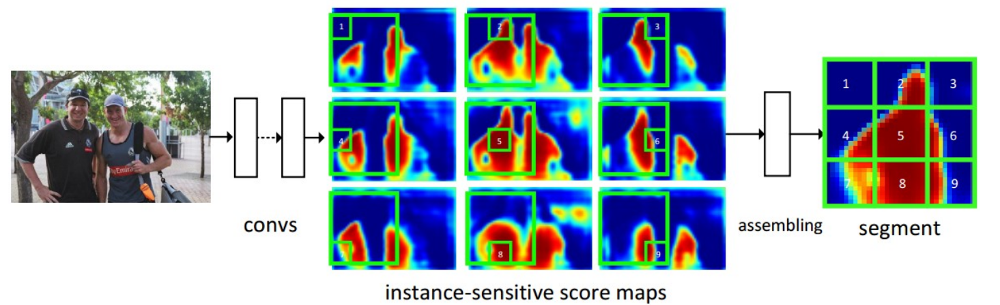
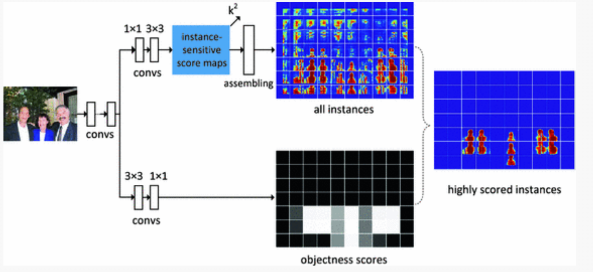
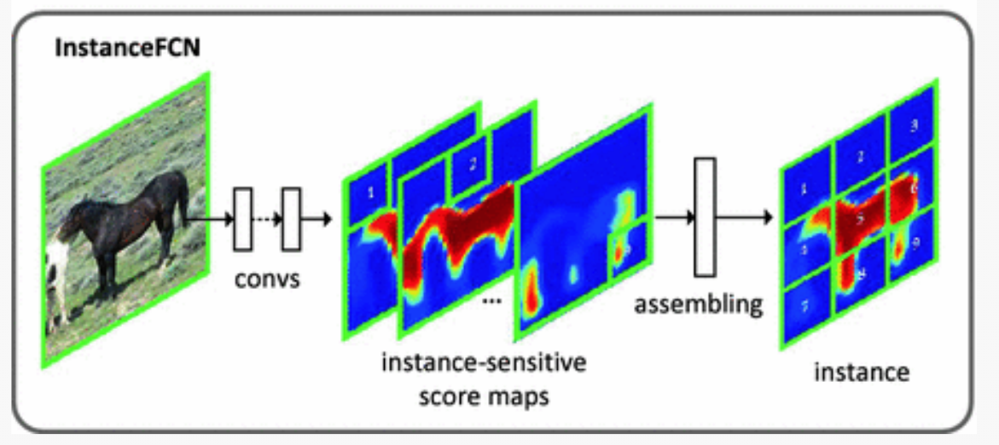

# InstanceFCN

## 基础信息

文章标题：Instance-sensitive Fully Convolutional Networks

文章链接：[https://link.springer.com/chapter/10.1007/978-3-319-46466-4_32](https://link.springer.com/chapter/10.1007/978-3-319-46466-4_32)

发表时间：2016-09 (ECCV 2016)

## 背景
对于以往的图像分割模型，由于卷积具有位置的不敏感性（对于相同的事物，在图像中处于不同的位置，卷积核的输出相同），导致了当两个相似的事物靠近时很难通过卷积来加以区分。

## 创新点简介
本文使用全卷积神经网络构建端到端的实例分割模型，它只分割每个实例，没有对实例进行分类。基于语义分割的模型，只有一种语义信息，如果两个实例距离贴就无法区分个体。这是由于卷积具有位置不变性造成的，作者使用滑动窗口，将窗口划分为9个小格（编号为1-9），每个格子代表了像素处于不同的位置，窗口滑动时，像素会被分到不同编号的小格子中，每个像素在不同的位置下有不同的分数。**同一个像素在不同的个体上所占的格子是不一样的**，而一个像素最多可被9种小格子包含，所以改模型可以。

## 详细内容
### 模型结构

### instance-sensitive score maps
实例感知的分数map，这里是一个通道数为$k^2$的分数map，$k^2$即上文提到的小格子数目（3x3只是其中的一种分法，作者也尝试了5x5 和 7x7的方法，但性能提高不多），每一个通道都表示当像素落在某个小格子上时所产生的分数。该分数map是由全卷积生成出来的。

### assembling
特征分数，分配网络，这个网络只是简单将使用滑动窗口，将窗口分成 $3 \times 3$个小格子，如下图所示，将每个小格子用与之对应的特征图里的分数进行填充，形成一个华东窗口的输出。作者所使用的滑动窗口大小为 $21 \times 21$, 滑动步长为8。（对于一个特征map窗口来说，只有1/9的数据被使用到，而其他的数据没有被使用到，他们不是浪费，在窗口滑动以后会被有重叠，就会被使用到）。但这种使用滑动窗口进行重组的方式可能会强行的将一个实例分到多个窗口之中，这样会导致一个像素特征对应多个通道，影响到其他通道。后来的FICS通过ROI解决了这个问题。[[2]](#inferece_2)

### objectness scores
对于每一个滑动窗口，会用一个分数来表示这个窗口内是否包含一个实例。这里使用了Local Coherence思想，简单来说，其实每一个像素都应该判断一下自己是否在对象上。然而，他们在小范围内往往是一样的。于是可以在一个窗口里判断是否包含目标实例。

### 训练
训练过程:

$$\begin{aligned} \sum _{i} (\mathcal {L}(p_i, p^*_i) + \sum _{j} \mathcal {L}(S_{i,j}, S^*_{i,j}) ). \end{aligned}$$
这里i是一个采样窗口的索引，pi是这个窗口中实例的预测对象性得分，如果这个窗口是正样本，pi是1，如果是负样本，pi是0。Si为该窗口中组装好的线段实例，$S_i^*$为ground truth线段实例，j为该窗口中的像素索引。L为logistic回归损失。也就是说，这里的判断是否有目标，和9个feature Map 是分开进行训练的，为了保证正负样本均衡，采用正负样本1：1抽样的方法抽取了256个样本窗口[[1]]](#inferece_1)。

## 引用

【Ren, S., He, K., Girshick, R., Sun, J.: Faster R-CNN: towards real-time object detection with region proposal networks. In: NIPS (2015)】

【Li, Yi, et al. "Fully convolutional instance-aware semantic segmentation." Proceedings of the IEEE conference on computer vision and pattern recognition. 2017.】
