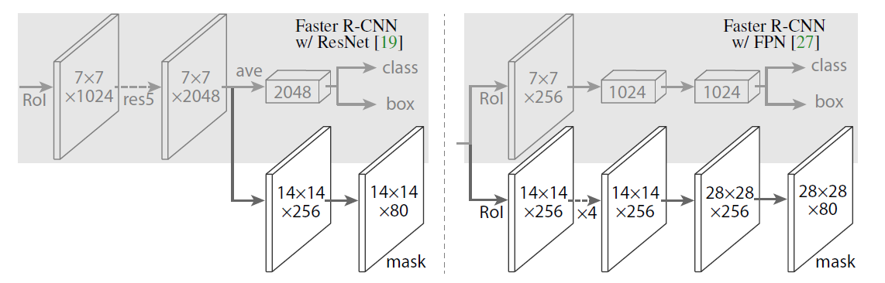
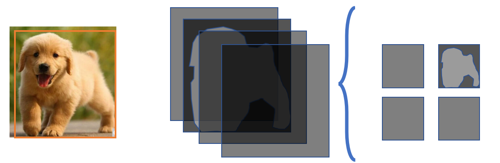
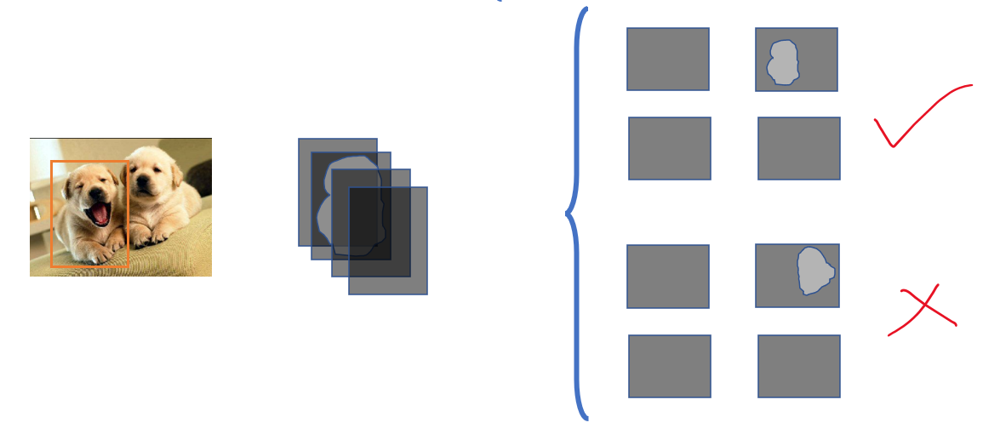
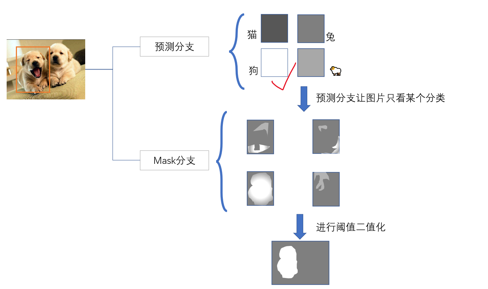
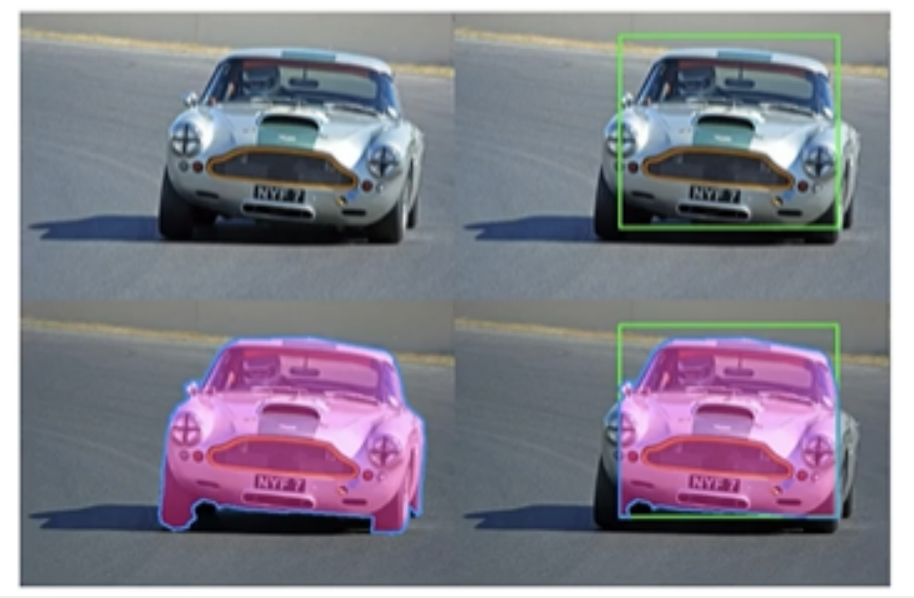
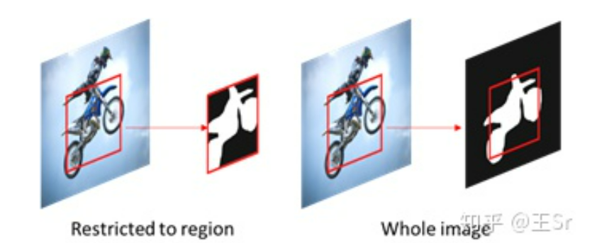
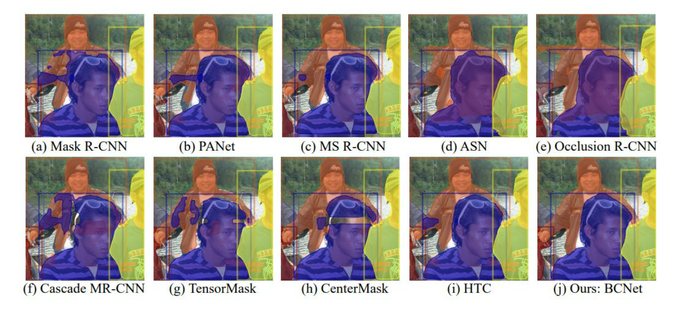
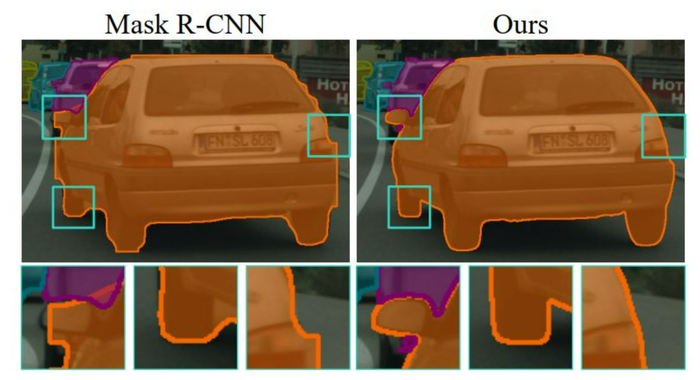
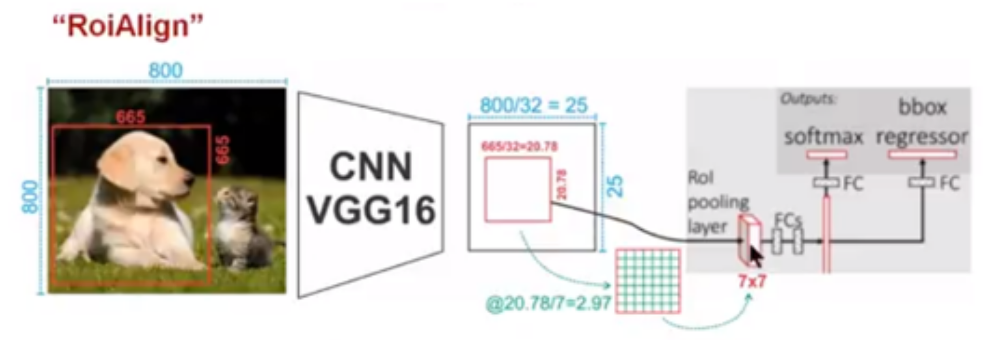

# MaskRCNN

## 基础信息

文章标题：MaskRCNN

文章链接：[Mask_RCNN](https://arxiv.org/pdf/1703.06870)

发表时间：2017-03

## 背景

## 创新点简介
MaskRCNN在FastRCNN的基础上加入了对于实例掩膜的预测分支，通过bounding box回归检测出每一个物品之后，再对回归框中的每一个像素进行分类，完成语义分割。这样的就实现了实例分割，即`目标检测+语义分割=实力分割`！

## 详细内容

### 实例分支训练
训练时，通过当前得到的真实mask中的类别class_id，遍历所有的预测mask，找到class_id类别所对应的预测mask(前向传播中介绍过每个类别都有一个预测mask)，比较真实mask与预测mask每个像素点信息，用的是binary_cross_entropy二分类交叉熵损失函数

**实例分割**

### 实例分预测

### 问题
1. 边框回归的精度会影响到实例分割的结果

解决方案[无论region有多大，我们都去在全图范围内预测（whole image）](https://zhuanlan.zhihu.com/p/121839698?from_voters_page=true)

2. 高度遮罩问题

解决方案[Deep Occlusion-Aware Instance Segmentation with Overlapping BiLayers](https://zhuanlan.zhihu.com/p/359610583)
引入GCN，实现对于遮罩物体和被遮罩物体的检测

3. 分割边缘粗糙

解决方案[Look Closer to Segment Better:Boundary Patch Refinement for Instance Segmentation](https://zhuanlan.zhihu.com/p/394526376)

### 【补充】为什么上面7*7的特征图
