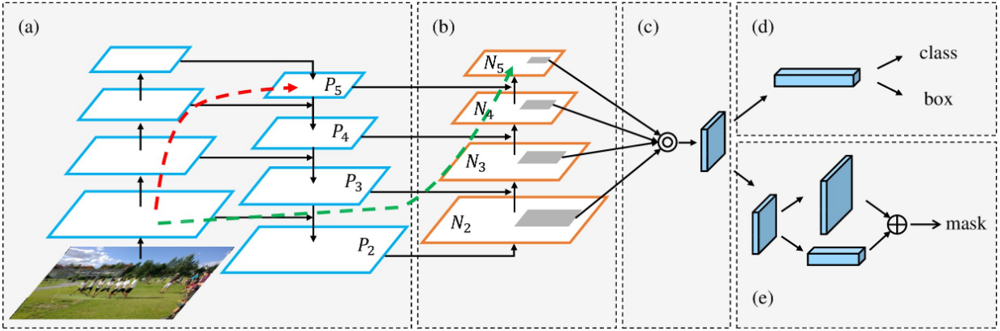
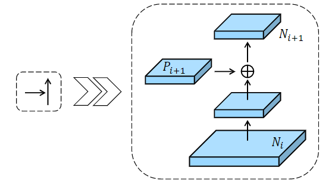

# PANet

## 基础信息

文章标题：Path Aggregation Network for Instance Segmentation

文章链接：[https://arxiv.org/abs/1803.01534](https://arxiv.org/abs/1803.01534)

发表时间：2018-03 (CVPR-2018)

## 背景
Mask-RCNN的信息传播还不够充分。低层特征到高层特征的传递路径过长，FPN中每个proposal只负责金字塔特定的一层，掩码预测只基于单一视角。

## 创新点简介
- 自底向上的路径增强，为了缩短信息传播路径，同时利用低层特征的精准定位信息
- 动态特征池化，每个proposal利用金字塔所有层的特征，为了避免proposal的随意分配
- 全连接层融合，为了给掩码预测增加信息来源，文中的说法是capture diffrent view

## 详细内容

### 模型结构

#### 第一部分：双塔结构

对于上图来说，a的部分在原本FPN的后面添加一个自底向上的金字塔。上图表示自下而上的路径增强构建块。

#### 第二部分：动态特征池化 

金字塔上四个灰色区域对应的是同一个proposal，使用ROIAlign将特征转化为统一的尺寸，进行融合。

#### 第三部分：全连接层融合

全连接层其实可由卷积实现，可看作感受野为整个特征图的卷积核，卷积出一个特征。通过全连接来加入全局的关系。

