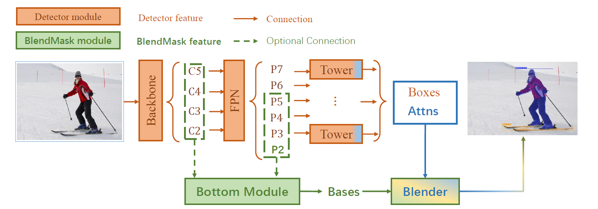
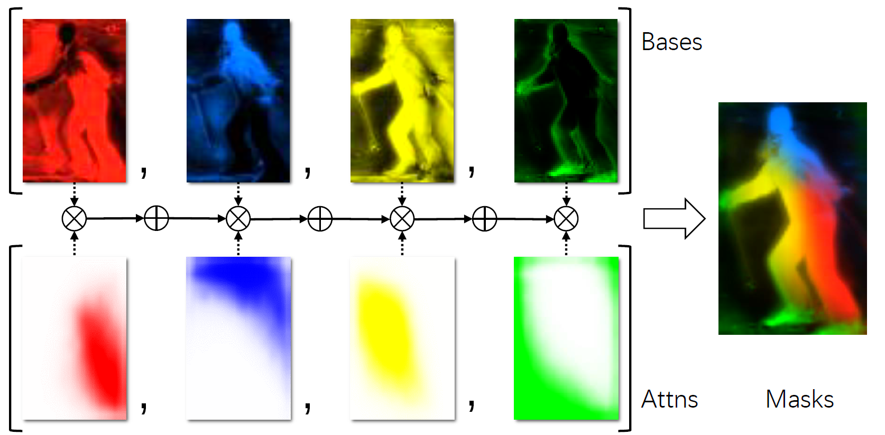

# BlendMask

## 基础信息

文章标题：BlendMask: Top-Down Meets Bottom-Up for Instance Segmentation

文章链接：[https://arxiv.org/abs/2001.0309](https://arxiv.org/abs/2001.0309)

发表时间：2020-01

## 创新点简介
本文使用提出了blender模型，将低层信息和高层信息融合，取得了更好的效果。其中高层信息会被制作成Attention map，而低层信息则包含更多的区分细节。轻量级模型在1080Ti上可达25FPS，用COCO数据集，mAP达34.2%。

## 详细内容
### 模型结构

上文所说的低层信息，就是这里从骨干和FPN输出中提取出来的`Bases`，而所谓高层特征则是通过了一个个又通过了Tower之后又经过`Boxes Attns`模块的信息，他们通过Blender进行相乘，然后相加融合，最终的输出。 

这里左图对`Bases`进行了可视化，而右图对`Boxes Attns`结果进行了可视化，将对应颜色的`attention` 和 `Base`进行相乘，让后相加就可以得到最后结果。 

### 训练与评估
训练时，通过标签的边界框就可以完成对于每一个实例的区分，而对于评估过程，作者使用FCOS 的预测结果。