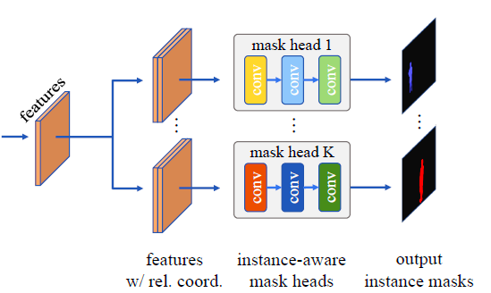

# CondInst

## 基础信息

文章标题：Conditional Convolutions for Instance Segmentation

文章链接：[https://arxiv.org/abs/2003.05664](https://arxiv.org/abs/2003.05664)

发表时间：2020-03

## 背景

## 创新点简介
CondInst 在全卷积网络FCOS的基础上通过引入条件卷积，完成了对于实例分割任务的实现。Condinst completes the task of instance segmentation by introducing conditional convolution on the basis of full convolution network fcos.

## 详细内容

### 模型结构

### 条件卷积细节
在计算边框和中心度分支的同级，引入条件卷积分支（一个3X3的卷积），输出结果为每一个特征像素*169的特征层，其中169 = （80+64+8）+（8+8+1）。表示三个卷积。前三个数是动态卷积的w，后三个数是动态卷积的偏置。特征层通过三个卷积得到最终输出的Mask

## 引用