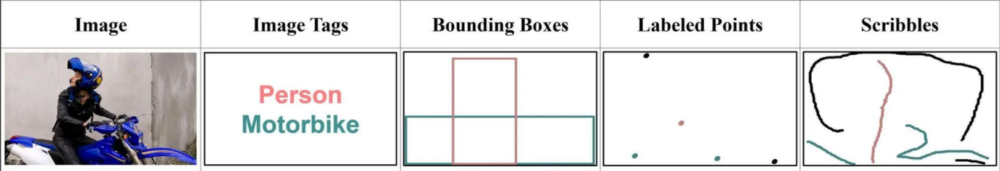
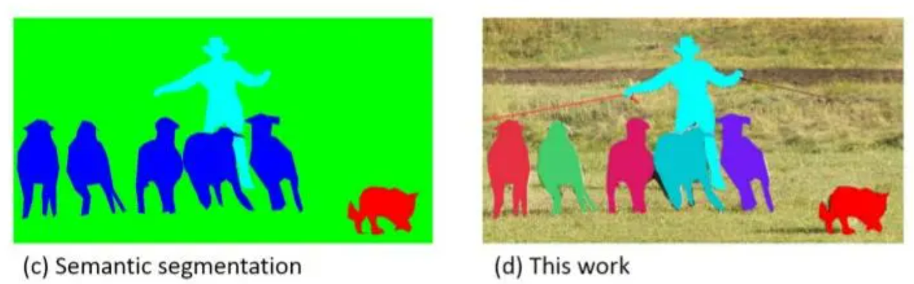

# 弱监督实例分割

## 基本问题
为解决人工标注实例所消耗大量时间的问题，弱监督实例分割(WSIS)利用更加简单的标签，例如检测框，图片分类标签来进行实例分割。

## 标签类别
弱监督标签分类通常分为以下的4种，分别是图片分类标签，边界框，点标注和涂鸦标注。 其中标注成本最小的图片分类，它仅仅提供了一张图片中所出现物品的分类信息，也叫做图像级别的标注。

## 两大问题
弱监督实例分割不同于语义分割，它既要对每个像素进行分类，又要区分不同的同类个体。

1. 像素分类问题：对于没一个像素，都需要知道其属于哪一个类别，一般会使用到类激活图的方式进行分类。
2. 同类物体区分问题：对于同一种类的不同个体，实例分割需要他们进行区分。常见的区分方法包括边界框区分，预测中心区分。

## 经典流程
一个完整的弱监督分割方法主要包含三个流程
1. 配合一些扩展算法，类激活图等生成伪标签。
2. 使用伪标签进行全监督的实例分割模型训练。
3. 使用随机游走,条件随机场等方法对输出结果进行调整。

### 伪标签的生成
伪标签的生成主要有三种方式，GrabCut， ，神经网络方式生成
1. GrabCut利用了图像中的纹理（颜色）信息和边界（反差）信息