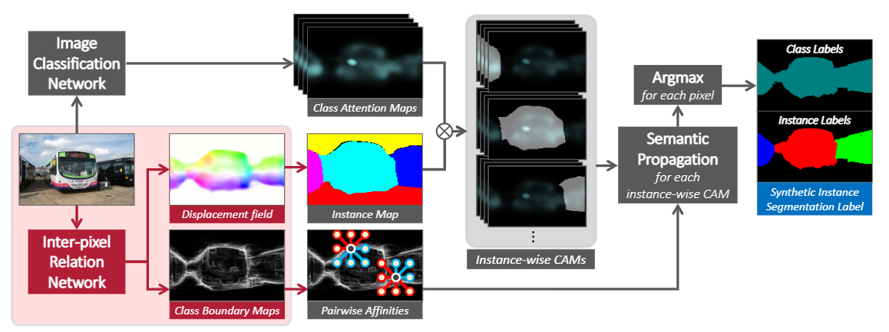

# IRNet

## 信息

文章标题：Weakly Supervised Learning of Instance Segmentation with Inter-pixel Relations

文章链接：[http://arxiv.org/pdf/1904.05044](http://arxiv.org/pdf/1904.05044)

发表时间：2019-04 (CPVR 2019)

## 背景

## 创新点简介

本文使用全集标记，类激活图完成了实例分割任务。为解决类激活图无法区分实例，使用了pairwise semantic affinitie（成对语义相似关系）和lass-agnostic instance map (无类别实例映射)。(类不可知实例映射是一个粗糙的实例分割掩码，没有类标签，也没有精确的边界。另一方面，一对像素之间的语义亲和力是它们之间的类等价性的置信度。)

## 详细内容

### 模型结构

### pairwise semantic affinitie（成对语义相似关系）
通过成对语义关系可以对个体的边缘进行判断。也即从图像中任意选取两个像素，当这两个像素属于不同的类别时，就认为他们之间存在一条边界

### lass-agnostic instance map (无类别实例映射)
预测每一个实例的重心（相对位置，且是个是矢量），表示该像素到预测重心的偏移。

