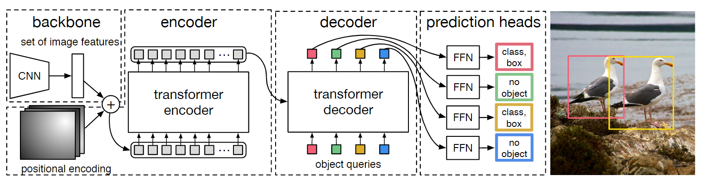
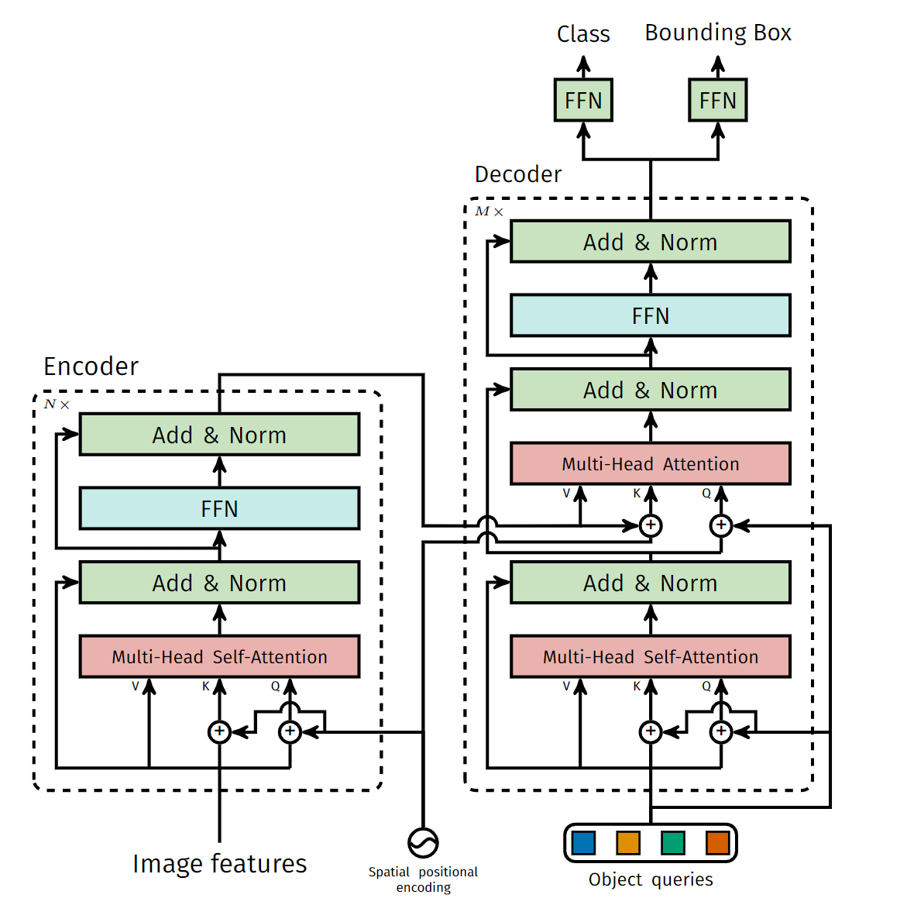
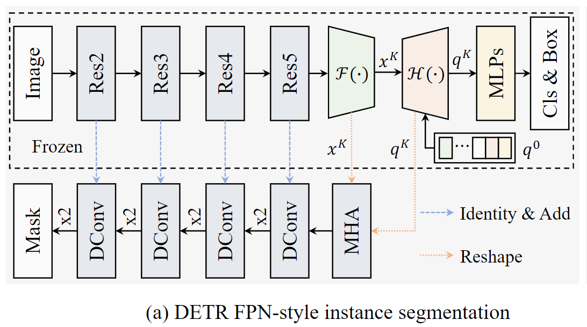

# DETR

## 基础信息

论文标题：End-to-End Object Detection with Transformers

论文链接：[https://arxiv.org/abs/2005.12872](https://arxiv.org/abs/2005.12872)

发表时间：2020-05

## 创新
DETR提出使用transformer，学习固定个数目标编码作为解码器的Q，来去除非极大化抑制的影响。具体来说首先使用CNN提取特征，然后将特征输入transformer的编码层，得到解码器的K和V，之后传入解码器，结合目标编码，产生解码结果，后通过MLP，映射到每一个对象的类别和边界框。和Faster RCNN转化为Mask RCNN一样，加入了mask head的DETR实现了分割任务。

## 详情

使用DETR进行实例分割

