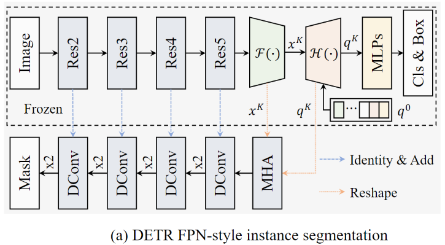
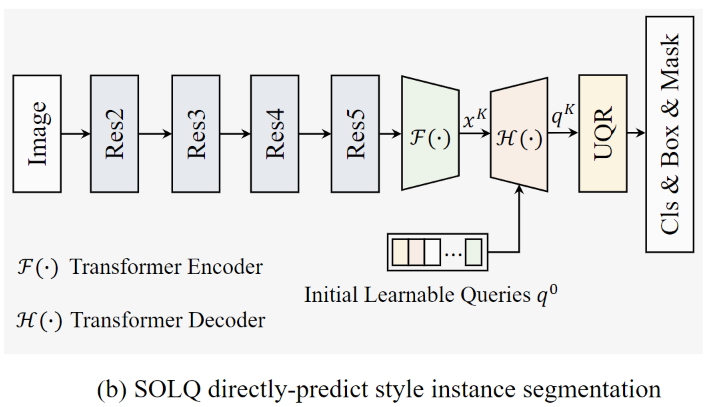

# Sparse RCNN

## 信息

论文题目：Sparse R-CNN: End-to-End Object Detection with Learnable Proposals

论文链接：[https://arxiv.org/abs/2011.12450](https://arxiv.org/abs/2011.12450)

发表时间：2020-11

## 创新

使用可学习的100-300个边框来取代RPN（区域建议网络），实现了一个完全稀疏的端到端目标检测网络。

## 详情

### 稀疏和密集

作者指出以前的目标检测都是每个特征像素做的，采用了“anchor boxes”机制，这会有十分密集的目标框（HWk个）产生，Faster RCNN 使用NMS筛选值的计算分类和边框回归的建议框，让一个密集的检测变得稀疏起来，但他仍然不能算是一个完全稀疏的目标检测方法（图b）。而本文作者所提出的Sparse RCNN则使用学习来的N(100或300)个RPN（可以理解为在训练集上的统计出了最可能出现目标的位置）直接进行分类和回归，是一个从始至终稀疏的模型。

### DETR
DETR 使用了100个固定大小的object queries来完成目标的确定，但是其每一个object queries都要与特征层的每一个像素进行交互，作者认为这是一种密集的操作，带来的结果是训练过程的十分的漫长，（个人感觉，这里也有使用transformer的原因）

如上图所示，对于DETR，它通过设置一个长采样卷积结构完成对于实例mask的获取

