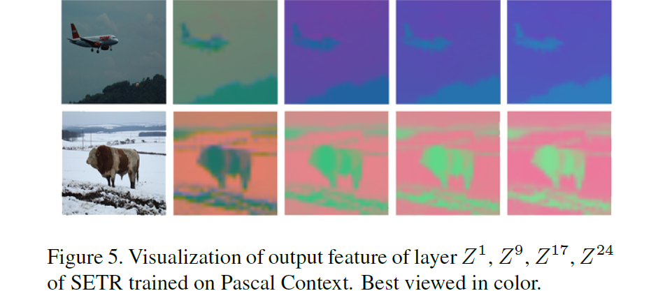

# SETR

## 基础信息

论文题目：Rethinking Semantic Segmentation from a Sequence-to-Sequence Perspective with Transformers

文章链接：[https://arxiv.org/abs/2012.15840](https://arxiv.org/abs/2012.15840)

发表时间：2020-12 (2021 CVPR)

## 背景

语义分割网络需要进行像素的分类，为例保证物体边缘像素被正确分类，需要很大的感受野支持，典型的语义分割Encoder-Decoder结构以多次下采样损失空间分辨率为代价来抽取局部/全局特征。网络Layer一旦固定,每一层的感受野是受限的,因此要获得更大范围的语义信息,理论上需要更大的感受野即更深的网络结构。

如何既能够抽取全局的语义信息,又能尽量不损失分辨率,一直是语义分割的难点。

## 创新点简介
SETR使用transformer设计了一个端到端的语义分割网络，首先将原图切割为若干 16x16 个窗口，把其中的像素进行线性映射，得到一维编码，然后使用24层transformer的编码器来完成对于图像特征的提取，然后使用卷积做上采样操作，得到最终结果。

## 详细内容

本文模型的整体结构是一个ViT（图中 a 结构）+Decoder（图中b,c结构，一种是上采样形式，一种是拼接型）

### 图像编码
1. 将H*W*3的图像序列化为 256个H/16*W/16*3的patch。transformer的输入sequence length就是H/16*W/16；
2. 向量化后的patch 经过Linear Projectionfunction得到向量$e_i$
3. 加入位置编码position embedding, 得到Transformer的输入$E_i = e_i + p_i$

### Transformer
这里的Transformer 只有 `encoder`结构，每个encoder层由多头注意力、LN层、MLP层构成。图像编码结构对应第一层输入$Z0$, 设一共有L层encoder，每一层encoder都将经过如下的步骤。
1. 生成(k, q, v), 注意这里的$W_Q$ 和 $W_K$ 维度要相同，$W_V$ 则决定了输出的维度。
   
$$query=Z^{l-1}W_Q, key=Z^{l-1}W_K, value=Z^{l-1}W_V$$

2. 计算 Self-attention (SA), 残差 + 加标准的$softmax(QK^T)V$

$$SA(Z^{l-1}) = Z^{l-1} + softmax(\frac{Z^{l-1}W_Q(ZW_K)^T}{\sqrt{d}})(Z^{l-1}W_V)$$

3. 多头自注意力就是重复计算了多个SA结构，即如下公式，其中$W_O \in \mathbb{R}^{md\times}C$， 将多头注意力拼接的矩阵变回输入时的$\mathbb{R}^{L\times C}$

$$MSA(Z^{l-1}) = [SA_1(Z^{l-1}); SA_2(Z^{l-1});... ; SA_m(Z^{l-1})]W_O$$ 

4. 经过MLP得到输出

$$Z^l = MSA(Z^{l-1}) + MLP(MSA(Z^{l-})) \in \mathbb{R}^{L \times C}$$

### Decoder
本文提出了三种Decoder设计：
1. Naive upsampling （粗糙的上采样 SETR-Na¨ıve）

   首先将最后一次Transformer Encoder的输出，经过映射调整通道数为分类数，之后经过 1 × 1 卷积 + 同步正则化 (w/ ReLU) + 1 × 1 卷积的管道，最后经过双线性上采样恢复原分辨率。

2. Progressive UPsampling（PUP）
   
   即上图中的b结构，交替使用卷积层和两倍上采样操作。为了从H/16 × W/16 × 1024 恢复到H × W 需要4次操作, 以恢复到原分辨率。

3. Multi-Level feature Aggregation (MLA)
   
   首先将Transformer的输出{Z1,Z2,Z3…ZLe}均匀分成M等份,每份取一个特征向量。如下图,24个transformer的输出均分成4份,每份取最后一个,即{Z6,Z12,Z18,Z24} .后面的Decoder只处理这些取出的向量。这四成特征经过reshape从`(H × W)/256 × C` 变为 `H/16 × W/16 × C`, 在经过（1 × 1, 3 × 3, 3 × 3）组成的三层卷积，进过4倍的上采样，自上而下的信息融合，注意处于下面的层拥有所有上层的信息，然后再进行拼接，最后再通过3x3的卷积操作，进行倍上采样得到最终结果。（这其实和残差有着类似的地方）。

## 优点
是语义分割领域的一次创行，将transformer引入到了语义分割领域中。

## 存在的问题
1. 切割的窗口过大，语义信息不精准。
2. 24层的Encoder 结构比较多余，通过作者的可视化结果们可以看到，到后面的特征图基本上变化非常小。$Z^1, Z^9, Z^17, Z^24$ 分别表示第1层，第9层，第17层，第24层卷积的输出结果。
   

## 参考
[https://zhuanlan.zhihu.com/p/353116737](https://zhuanlan.zhihu.com/p/353116737)