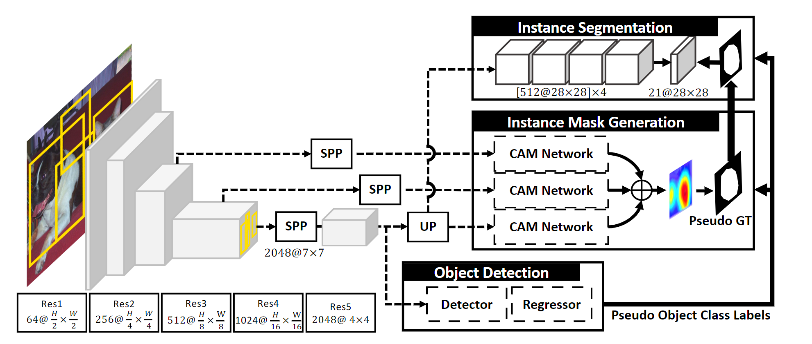

# CommunityLearning

## 基础信息

文章标题：Weakly Supervised Instance Segmentation by Deep Community Learning

文章链接：[https://arxiv.org/pdf/2001.11207.pdf](https://arxiv.org/pdf/2001.11207.pdf)

发表时间：2020-01

## 背景
对于弱监督的实例分割，简单的结合检测和分割网络的一个最关键的限制是，学习到的模型往往关注对象的小区域，无法恢复目标对象的缺失部分。这在一定程度上是因为**分割网络依赖于噪声检测结果，而没有适当的交互作用**，迭代标签细化过程的好处往往在早期阶段就饱和了。而两个模块输出之间的强相关性。

## 创新点简介
作者提出将目标检测，伪标签生成，实例分割等组件构造成一个循环链。该链有助于各个模块之间的交互，从而提取有用的信息。
(社区学习， community learning)这篇文章通过训练多个子模型用于多个子任务，end-to-end trainable deep neural network with active interactions between multiple tasks。

社区学习与多任务学习不同，后者试图在没有参与模块之间紧密互动的情况下平行实现多个目标。
The community learning is different from multi-task learning that attempts to achieve multiple objectives in parallel without tight interaction between participating modules.

## 详情

模型一共分为4个部分，特诊提取网络，目标检测网络，伪标签生成模块和实例分割网络，模型首先从检测模块中识别出积极的检测包围框，并使用类激活映射生成实例分割的伪标签。该模型使用伪标签对三个成分进行多任务缺失训练。通过实例掩码生成模块和分割模块输出的集合，得到最终的分割掩码。

【Object Detection Module】

作者参考OICR，提出了一种基于 伪标签 的类不可知边界盒回归器，以避免过度区分的表示学习，并提供更好的正则化效果。

【Instance Mask Generation (IMG) Module】

这个模块使用目标检测的给出的提议框为实例分割构造伪地面真相掩码。它从附加到多个卷积层的SPP层中提取每个提案的特征。由于IMG模块利用骨干网中不同层次的层次表示，它可以有效地处理多尺度对象。模块的输出是三个CAM的平均值，输出$\widetilde{M}$的维度是$\mathbb{R}^{C+1}\times T^2$。上图中的T选择$28 \times 28$

【Instance Mask Generation (IMG) Module】

从低层的Res5 上采样到$T \times T$, 经过4层卷积，进行激活，和伪标签生成模块IMG的输出做损失。

## trick
- 在使用有实例框的标注中，可以不使用全局平均池化，而是适当的提高中间的权重。
- 使用$log(1+f)$作为CAM的输入，这样可以抑制峰值, $f$表示特征的输出。