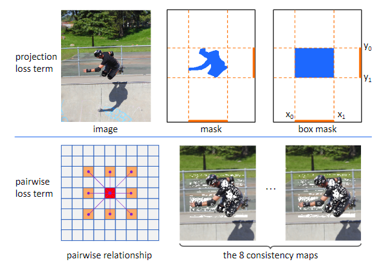

# BoxInst 变量
本文简单介绍BoxInst 模型中所使用到的关键变量

## 基础信息

论文标题: BoxInst: High-Performance Instance Segmentation with Box Annotations

论文链接：[https://openaccess.thecvf.com/content/CVPR2021/html/Tian_BoxInst_High-Performance_Instance_Segmentation_With_Box_Annotations_CVPR_2021_paper.html](https://openaccess.thecvf.com/content/CVPR2021/html/Tian_BoxInst_High-Performance_Instance_Segmentation_With_Box_Annotations_CVPR_2021_paper.html)

发布时间: 2020-12 (CVPR 2021)

## 创新点总结
提出了一种高性能、仅使用边界框注释进行训练的任务级实例分割。（例如，在COCO数据集上，大幅提高了先前最佳报告的掩码AP 21.1%[12]至31.6%）。核心思想是重新设计实例分割中的学习掩码损失，而不修改分割网络本身。新的lossFunction可以在不依赖掩码注释的情况下监督掩码训练。这可以通过两个损失实现，即：1）一个替代项，该替代项最小化地面真值盒的投影和预测掩模之间的差异；2） 一种成对丢失，它利用了一种先验知识，即具有相似颜色的近端像素很可能具有相同的类别标签。

### 创新点
设计了一个更加有效的损失函数，损失函数包含两个部分。
> ① 对预测的掩膜在宽高上的投影与Gound Truth在宽高上的投影进行比较
> 
> ② 将颜色相似的像素归为同一个类，形成mask，让后就可以用来训练了

### 结果
通过一个ResNet-101主干网，我们在COCO测试开发拆分中实现了33.2%的掩码AP（与完全监督对应的39.1%相比）。

### 流程图
<pre><embed type="image/svg+xml" src="../../../img/article/boxinst_vars.svg" /></pre>