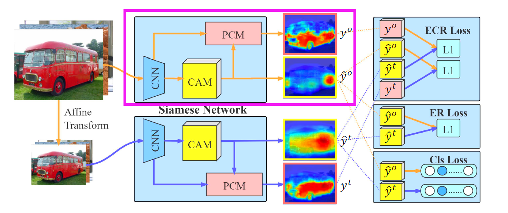

# CRF-RandWalk

## 背景描述
上文说到CAM方法，是一种在分类网络基础上替换网络的全连接层为，卷积+全局平均池化。由于对于一个目标是否属于一个类别来说，网络只需关注最有特点的地方，而不能完全覆盖一个目标。弱监督语义分割试图从CAM中得到掩码就需要让其关注整个目标，于是概均匀化的思想被提出。

## 概率均匀化
【本质】：设计一种概率转移方法，将图像中的密集概率向着整个物品进行扩散。也就是说通过计算两个特征像素之间的相似性，如果相似的话，就让当前像素上的概率和这个像素的概率进行均摊。

## 条件随机场

条件随机场通过“势函数”的引入，将初始的概率图进行转化。
势函数包含了图片的像素色彩和位置信息

## PCM

图片来源于[https://arxiv.org/pdf/2004.04581v1](https://arxiv.org/pdf/2004.04581v1)
PCM通过计算特征之间的相似程度，通过相似程度，进行概率转移。计算方式为余弦相似度。

## 随机游走
状态转移矩阵，类比酒鬼模型。
