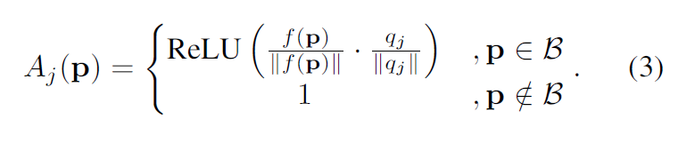
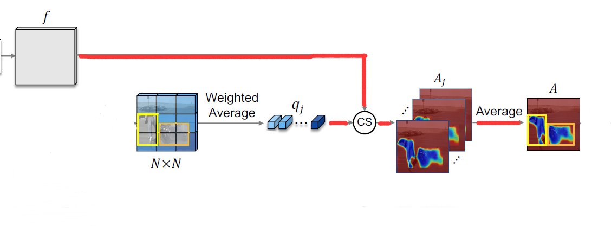
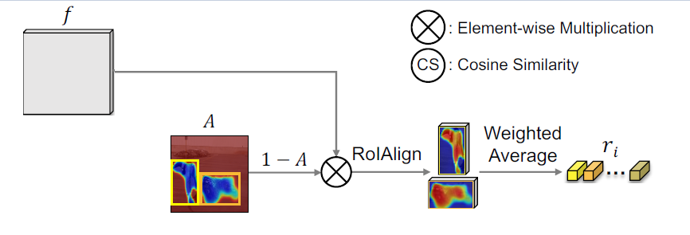
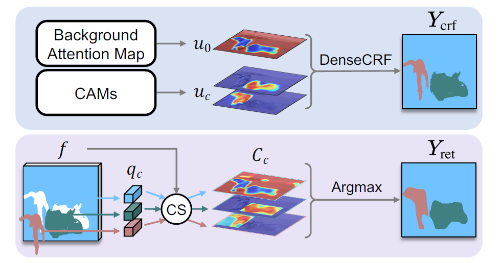

# BAP_NAL

## 基础信息

文章标题：Background-Aware Pooling and Noise-Aware Loss forWeakly-Supervised Semantic Segmentation

文章链接：

发表时间：

## 背景

## 创新点简介
①提出了BAP（背景感知池）方法，能够在边界框内分辨出前景和背景，相比于GAP方法，不会只考虑到局部。
②我们引入了一个噪音感知损失（NAL）来训练CNN的语义分割。

**效果**：
在PASCAL VOC 2012数据集上使用DeepLab-V1（VGG-16）与最先进的方法进行定量比较，以mIoU计。粗体数字表示最好的性能，下划线的数字是第二好的。
`Image-level labels (10K) with Saliency (3K)`
| 方法              | 价值 | 测试 |
|------------------|------|------|
| SeeNetNIPS’18    | 61.1 | 60.7 |
| FickleNetCVPR’19 | 61.2 | 61.9 |
| OAAICCV’19       | 63.1 | 62.8 |
| ICDCVPR’20       | 64.0 | 63.9 |

`Supervision: Boxes (10K)`
| 方法              | 价值 | 测试 |
|------------------|------|------|
| BoxSupICCV’15    | 62.0 | 64.6 |
| WSSLICCV’15      | 60.6 | 62.2 |
| SDICVPR’17       | 65.7 | 67.5 |
| BCMCVPR’19       | 66.8 | -    |
| w/Y_{crf}        | 67.8 | -    |
| w/Y_{ret}        | 66.1 | -    |
| w/Y_NAL          | 68.1 | 69.4 |

`Boxes (9K) with Masks (1K)`
| 方法              | 价值 | 测试 |
|------------------|------|------|
| BoxSupICCV’15    | 63.5 | 66.2 |
| WSSLICCV’15      | 65.1 | 66.6 |
| SDICVPR’17       | 65.8 | 66.9 |
| BCMCVPR’19       | 67.5 | -    |
| w/ NAL           | 70.5 | 71.5 |

## 详细内容
### BAP部分
【整体流程】如下图所示，输入通过特征提取，接下来将特征值池化成N*N的格子，通过softmax，分类每一个类（包括背景）进行训练，使网络可以对目标进行提取。

【背景平均特征向量】在这个过程中，为了得到前景（目标）的伪标签，作者逆向思维从背景出发进行寻找（找到背景剩下的就是前景了）。首先通过公式（1）来计算一小块N*N格子中背景的均值向量，其中G(j)表示每个网格单元，M(p)不属于 前景框的像素。通过公式（1）的计算，就使得 *qj* 的值表示了N x N格子中的背景的所有像素的特征向量均值。

【背景概率图】接着我们用这j个特征向量均值和前景框里的每一个像素上的特征向量进行一次<text color="red">余弦相似度计算</text>，即公式（3）。如果一个格子全是背景，其特征向量经过均值处理，还是表示背景，在和背景上的像素做余弦相似度时，其值会十分接近于1，而对于在前景的像素格子，前景像素点的特征向量和背景均值的特征向量差异较大，其值接近会较小（可以类比将3个指向12点的向量，进行平均，那么他还是12点方向），这样就可以近似的区分前景和背景了。对于每一个 *qj* 和前景框里像素做余弦相似度，都会产生一张余弦相似度图，一共有j个，为了综合表示前景和背景的概率，作者对这j个余弦相似度图取了平均，即公式（2）。（有人可能会说，背景也有变化很大的情况呀，进行均值以后再和每一个背景像素进行比较，能一样吗？如果你是这么想的，那么这里你忽略了一个问题，我们现在说的背景已经是特征图了，经过卷积的特征图包含的背景信息是相交统一的，具体可以参考CAM操作）

**注：f(p)/||f(p)|| 和 qj/||qj||都表示向量归一化，B表示前景框里的像素集合**

【前景概率图】求出了背景的区域的概率A(p)，这样，我们用1减去这个A(p)就得到了每一个像素属于目标物体的概率。接着，类似于公式（1），这里的公式（4），其中 *ri* 表示了一个前景格子中前景部分的平均特征向量。

【训练过程】
这里的qj和ri可以理解为将原图像素进行了N*N的特征池化操作，所以直接把这两个均值向量融合，当作一张特征图，后面就接图像分类的softmax那一套东西了。

### 伪标签生产

$$Y_{crf}$$
输入背景图片概率和经过归一处理的前景概率们，进行DenseCRF产生[]

## 引用