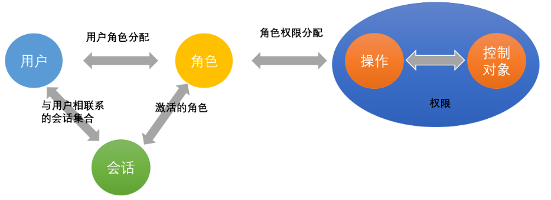
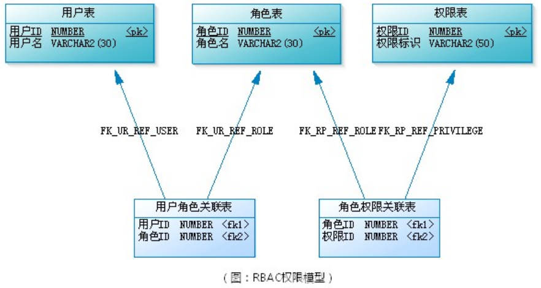
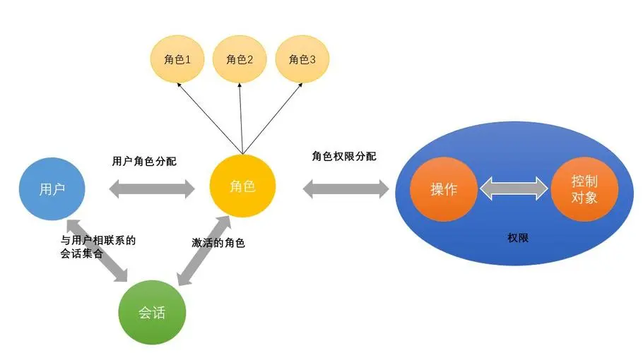
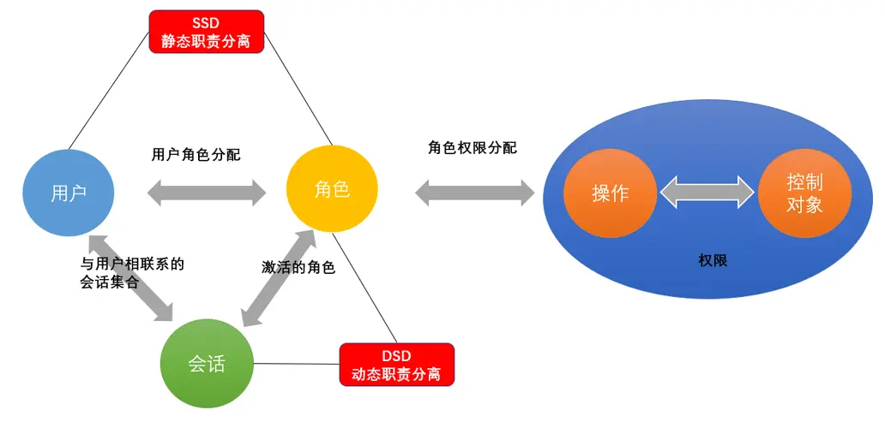

# RBAC 基础 

 

## 介绍 
RBAC 全名（Role-Based Access Control）基于用户的访问权限控制。用来约束用户对资源的访问。为用户提供相应权限，保证系统的正常运行。RBAC从总体上说有4个大的划分，他们分别是RBAC base （基础核心版），RBAC 1 （角色嵌套版），RBAC 2 （角色约束版），RBAC 3（3=1+2）

 

## RBAC base
RBAC 将用户对资源的访问用 "角色" 进行分离控制。即一个用户可以拥有多个角色， 而一个角色可以拥有多个资源的访问权限。如下图所示。

## RBAC 1
在 RBAC Base 的 基础上加入了角色间的继承关系。也有的规范中抽象出了用户组的概念，其实本质都是角色之间的嵌套包含关系。

## RBAC 2
在 RBAC Base 的基础上加入了角色之间的与约束。当一个用户拥有多个角色时，其角色之间可能会存在着冲突。例如一个人是一位老师，但是他任然报了其他的课程，是一名学生。处理这个问题的方法有两种。一种叫做 SSD (静态权限分离)。 一种叫做DSD (动态权限分离)。

【SSD (静态权限分离)】：指用户无法同时赋予有冲突的角色。 如果一个人已经有了老师的角色。那么他不能用拥有学生听课的权力，如果要听课，可以再申请一个学生的账号来听课。或者说，在设计权限时，学生账号是一个基础的，只要用户登录就拥有学生的所有功能，那么在用户拥有老师权限时，只是给用户添加对应的操作权限，这种 “纯增量式” 的权限十分适合使用 SSD。

【DSD (动态权限分离)】：指用户在一次会话(Session)中，不能同时激活自身所拥有的，互相冲突的角色，只能选择其一。 例如在一堂课中，老师和学生的身份你只能选择一个，但是在另一门课中，你则可以转化身份。用户在同一次请求时只表现为一个角色。

## RBAC 3
 
和公式 `1 + 2 = 3` 一样，RBAC 三即 包含了角色嵌套和权限约束的访问权限控制。

## 其他模型

权限认证不是只有 RBAC 模型的，其他类似的还有基于属性的权限管理模型（ABAC），伴随着自主访问控制（DAC）和强制访问控制（MAC）。分布式和多租户等新的应用场景下，更多的权限控制模型被提出来。只有不断地学习进步，才能在如今的裁员浪潮中保身啊！！ 加油吧，少年。
