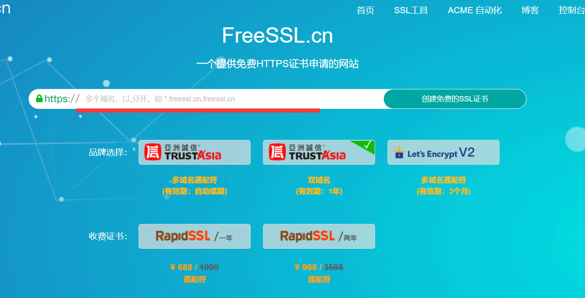
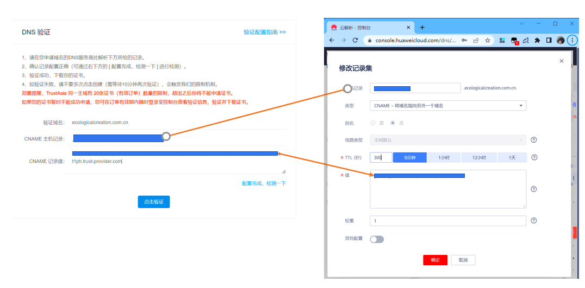
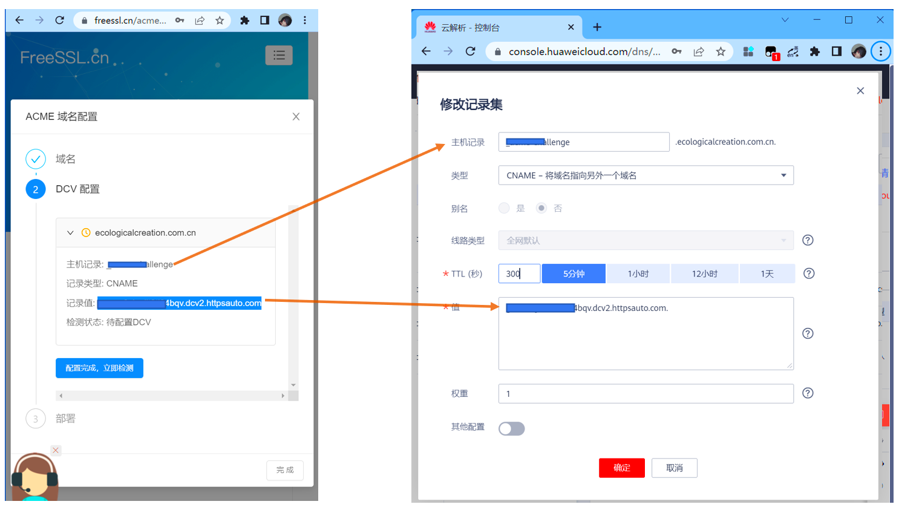
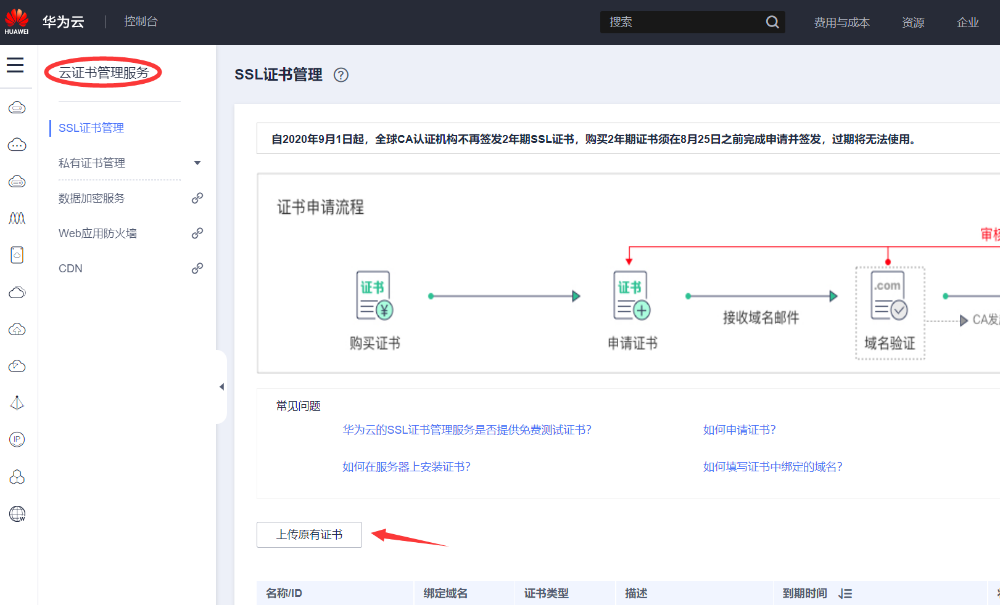
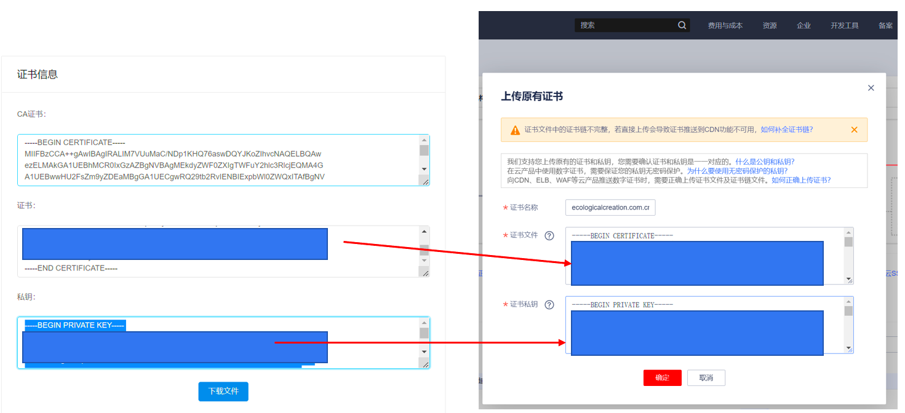
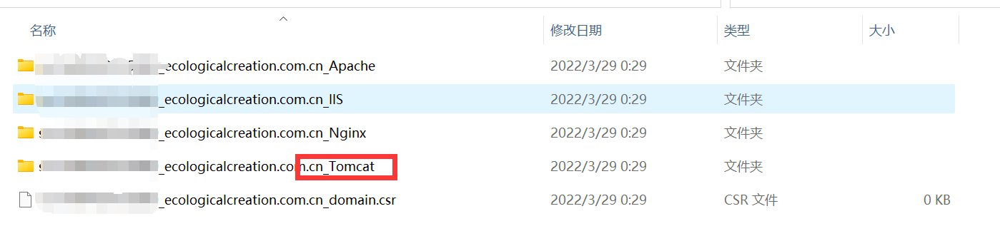
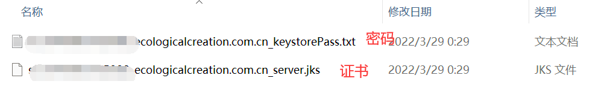

# 申请SSL免费证书

## 什么是SSL？


## 如何申请免费SSL证书

> **1. 访问网站 https://freessl.cn/**
> 
> 
> 在横线上填写自己要声请的域名，点击确定


> **2. 在域名提供商处填写以下字段**
> 
> 如果以华为云为例，就是下面这样，像添加一个普通的域名解析一样，只不过要注意类型这里要换成CNAME。
> 
> 
> 
> 或者你的界面可能是下面这样，和上面类似
> 
> 
> 
> 填写完成之后，就可以点击验证，就可以看到证书密钥。如果第一次点击没有反应，可能是还没有解析成功，大概两分钟内就会解析成功。

> **3. 配置SSL证书**
> 
> 在华为云找到云证书管理服务，上传原有证书
> 
> 
> 
> 根据FreeSSL所给出的公私钥信息，填写到华为云相应的位置
> 
> 


## 配置到SpringBoot上
> **1. 从云端下载证书到本地**
> 在华为云上传证书的界面，你可以看到自己已经上传的证书，其中有一项为下载。点击下载，可以得到证书压缩包。
> 

> **2. 解压证书，选择Tomcat**
> 
> 
> 
> 
> 
> 之后将证书放入Springboot的resource里
> 
> 

> **3. 在application.properties中加入以下内容**
```shell
server.port=443
server.ssl.key-store=classpath:******_ecologicalcreation.com.cn_server.jks # 修改为自己的证书
server.ssl.key-store-password=密码 # 在Tomcat那个文件夹里的 **** _keystorePass.txt
server.ssl.key-store-type= JKS
```

> **4. 在SpringBoot的入口文件写入如下内容**
```java
package com.example.demo;

import org.apache.catalina.Context;
import org.apache.catalina.connector.Connector;
import org.apache.coyote.http11.Http11NioProtocol;
import org.apache.tomcat.util.descriptor.web.SecurityCollection;
import org.apache.tomcat.util.descriptor.web.SecurityConstraint;
import org.springframework.boot.SpringApplication;
import org.springframework.boot.autoconfigure.SpringBootApplication;
import org.springframework.boot.web.embedded.tomcat.TomcatServletWebServerFactory;
import org.springframework.boot.web.servlet.server.ServletWebServerFactory;
import org.springframework.context.annotation.Bean;

@SpringBootApplication
public class DemoApplication {

    public static void main(String[] args) {
        SpringApplication.run(DemoApplication.class, args);
    }

    @Bean
    public ServletWebServerFactory servletWebServerFactory() {
        TomcatServletWebServerFactory factory = new TomcatServletWebServerFactory() {
            @Override
            protected void postProcessContext(Context context) {
                SecurityConstraint securityConstraint = new SecurityConstraint();
                securityConstraint.setUserConstraint("CONFIDENTIAL");
                SecurityCollection securityCollection = new SecurityCollection();
                securityCollection.addPattern("/*");
                securityConstraint.addCollection(securityCollection);
                context.addConstraint(securityConstraint);
            }
        };
        factory.addAdditionalTomcatConnectors(redirectConnector());
        return factory;
    }

    private Connector redirectConnector() {
        Connector connector = new Connector(Http11NioProtocol.class.getName());
        connector.setScheme("http");
        connector.setPort(80);
        connector.setSecure(false);
        return connector;
    }
}

```
