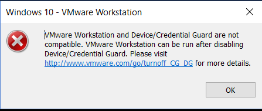

# 安装错误

## VMware Workstation and Device/Credential Guard are not compatible. VMware Workstation can be run after disabling Device/Credential Guard.

1. 关闭 Hyper-V
 `win11` 使用虚拟机`VMware`是不需要的开启`Hyper-V`的，但是如果遇到了蓝屏错误，需要升级`VMware`
2. 以管理员身份打开命令提示符窗口
运行`bcdedit / enum {current}`
注意，如果需要恢复这种情况，请记下HyperVisorLaunchType
运行 `bcdedit / set hypervisorlaunchtype off` 以禁用管理程序在执行命令后关闭命令提示符并重新启动系统。
