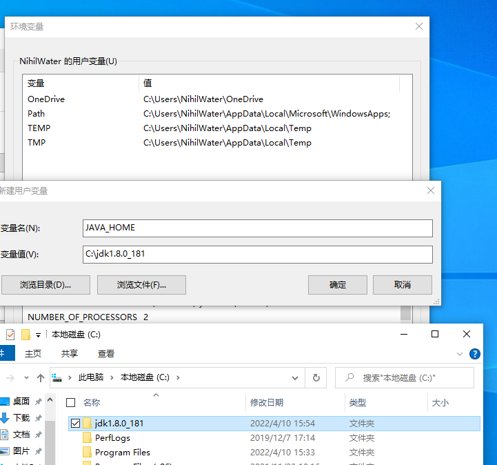
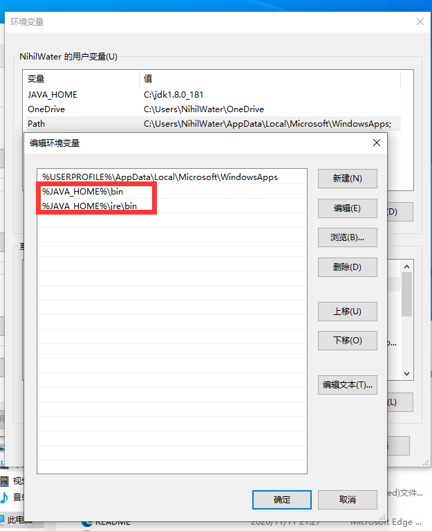
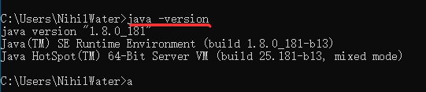
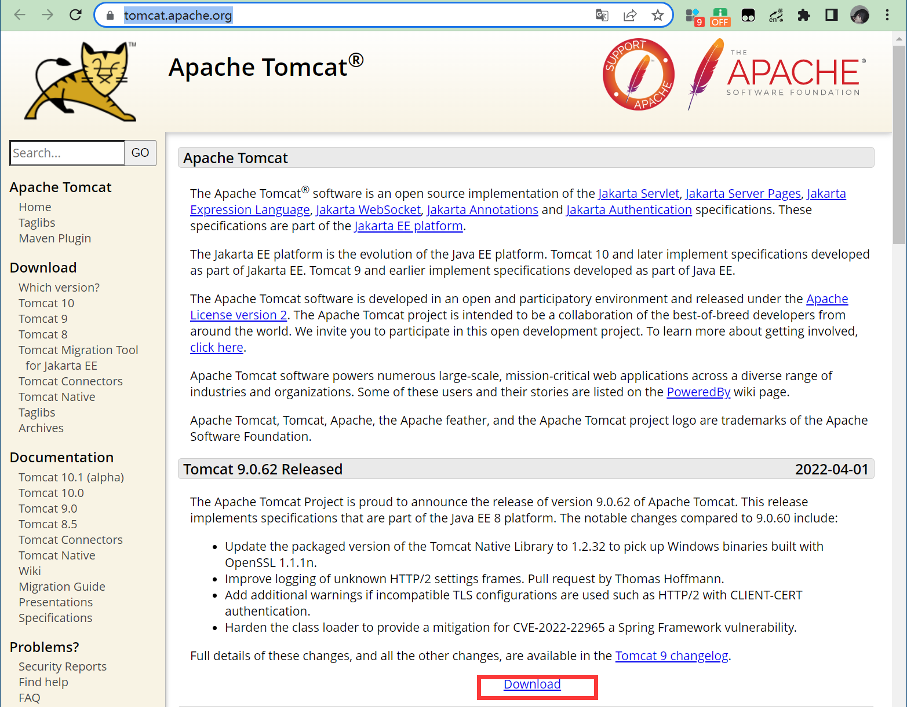
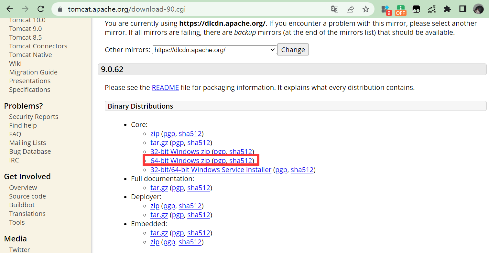
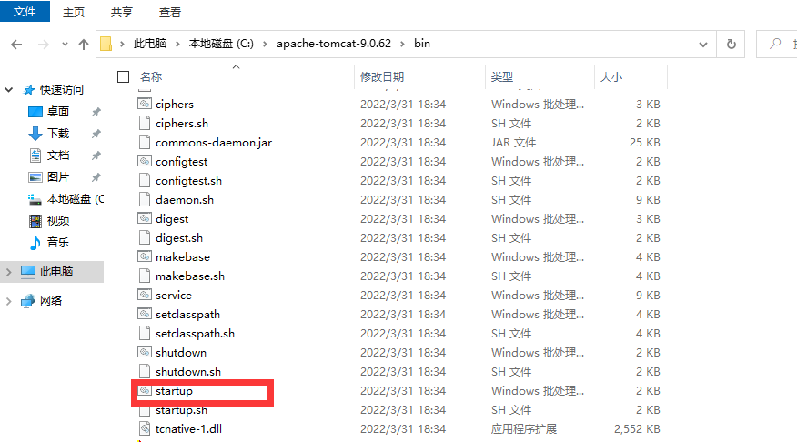
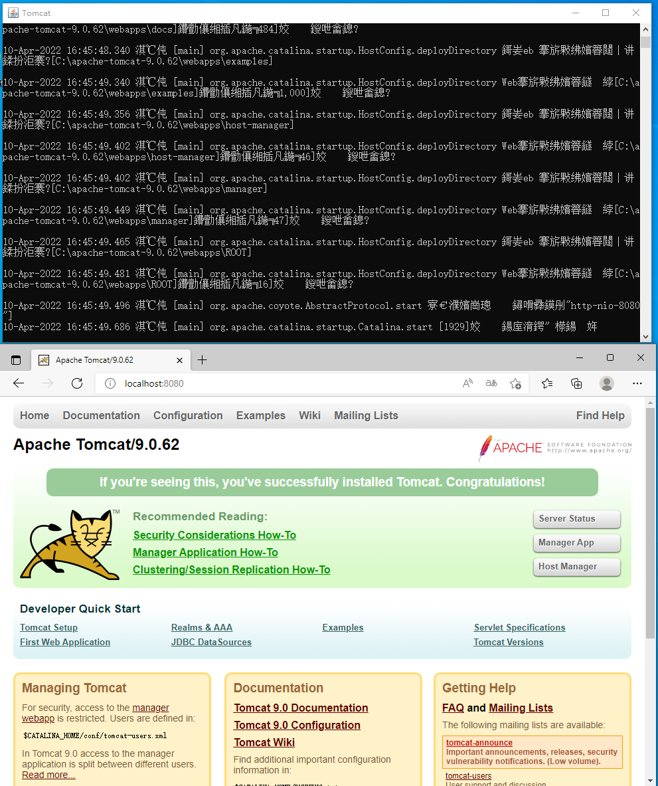

# Windows Tomcat 安装

## 安装 java

由于`Tomcat`是基于`java`的，所以安装`jdk`是安装`Tomcat`的第一步。对于国内环境来说，`java8`仍然是最常用的，所以连选择环境的考虑都不用考虑了。作者使用的`java8`是免安装的。解压后仍然需要配置环境。以便从中学习配置的细节。

1. 解压下载的压缩包
2. 配置环境变量
   > JAVA_HOME

   
   
   > PATH
   ```txt
   %JAVA_HOME%\bin;%JAVA_HOME%\jre\bin;
   ```
   

3. 检测java环境是否正确
   
   使用 `java -version` 来进行判断，如果显示出了结果，则成功了。

   

## 安装 Tomcat

下载连接： [https://tomcat.apache.org/](https://tomcat.apache.org/)





下载zip之后，找到文件夹里的`bin\startup.bat`双击运行。



如果一切正常时，结果会产生一个小黑窗，在倒数第二行的最后，可以看到端口号为`8080`。接着使用浏览器，输入`localhost:8080`就可以进行访问了，至此`Tomcat`的安装就完成了。


