# JBoss 的安装和系统部署

## 1、下载JDK6！！
JBoss 已经不在维护，并且更名为WildFly。如果您执意要使用JBoss部署，请务必下载比较旧的JDK，这种上古的项目就需要我们拿着上世纪的火铳... 

否则将会出现一些列的问题，小编解决了一个，又来一个...

下载地址如下，这里选择华为云的jdk镜像，如果之前已经安装过Java 8，记得将环境变量中的JAVA_HOME 替换为1.6的。、

> https://repo.huaweicloud.com/java/jdk/6u45-b06/

<br/>

## 2、下载JBoss 解压包
下载链接如下 

> https://jbossas.jboss.org/downloads

对于windows用户使用zip压缩包就可以，如果是linux 则使用Gz 压缩包。本文以windows 为例子   

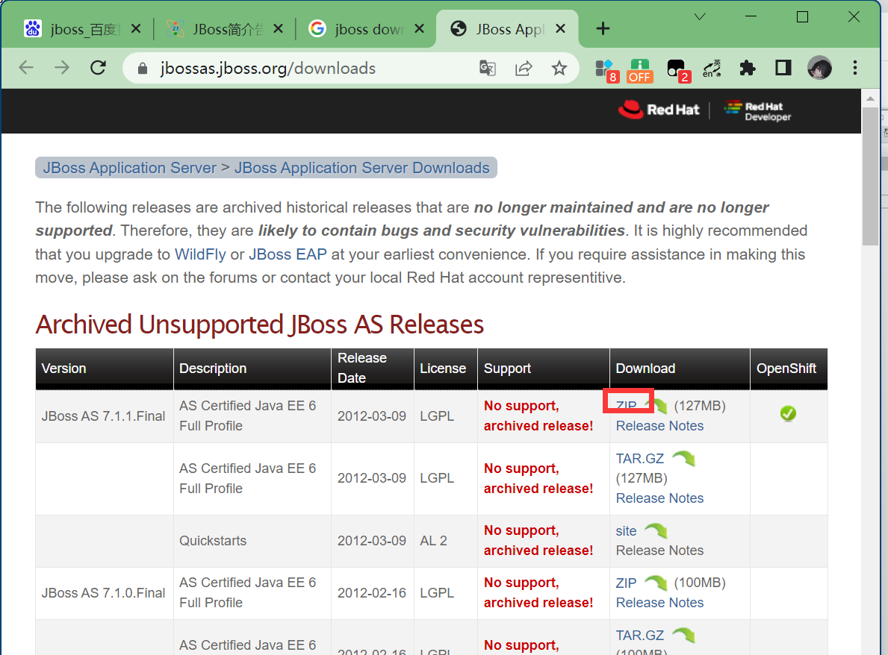

<br/>

## 3、配置环境变量 

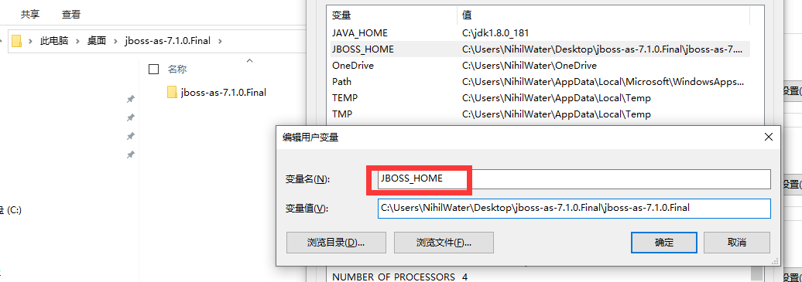

<br/>

## 4、启动方法
找到bin目录下的standalone.bat，双击启动即可。

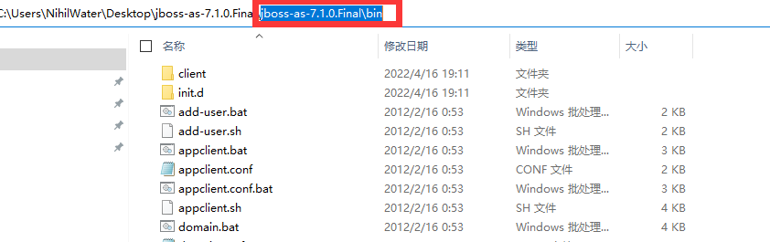

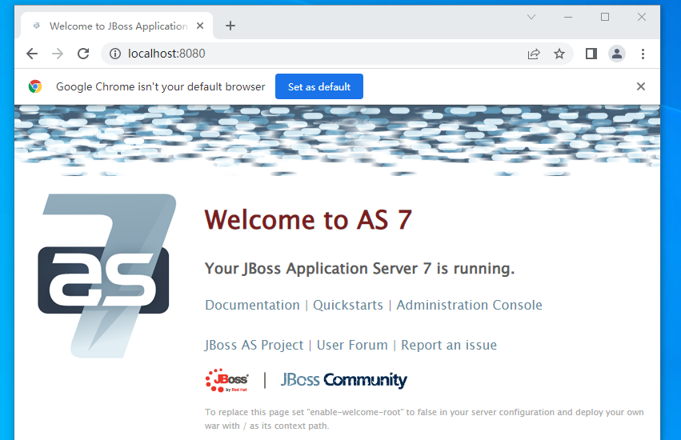

## 5、解决报错

这只是使用JAVA 8 是JVM的一个小错误，后继包的错误，小编无力再调整了...先记录一下，以给上古的先人们一个修改JVM参数的方法。
> 报错如下
> 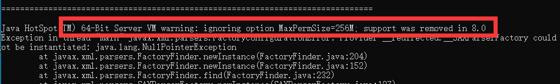

修改同目录下的以下两个位置，这两个位置的环境变量会在程序启动时被使用。
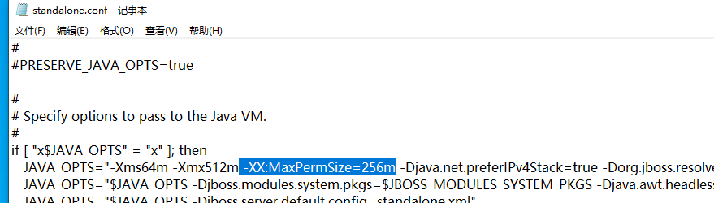

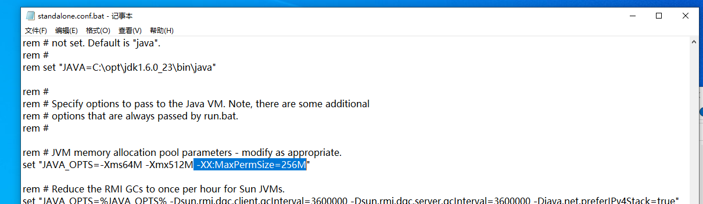


## 6、部署应用
首先将文件打包成war包，将War包放在jbossas 的 `standalone\deployments`文件夹下，最后再次找到bin目录下的standalone.bat，双击启动即可。

建议开发过程就打包，如果拿到手的是没有打包的可以执行以下命令进行打包。
```shell
jar -cvf WebReport.war .
```

以帆软为例，我们找到它的服务端程序。一个明显的特征就是其中有一个叫做`WEB-INF`的文件夹。

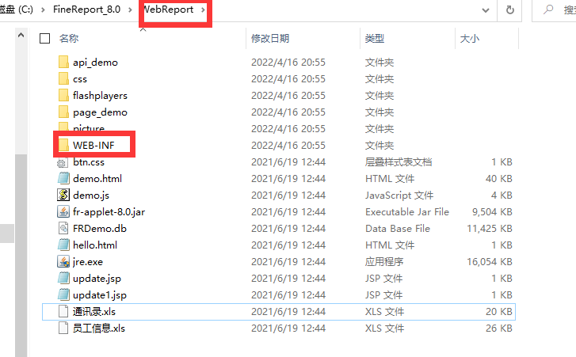

在当前目录下执行`jar -cvf WebReport.war .`就可以获取一个名为`WebReport.war`的war包。

接下来将War包放在jbossas 的 `standalone\deployments`文件夹下。

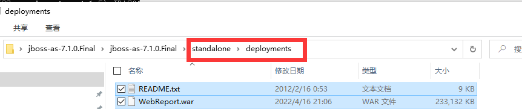


最后再次找到bin目录下的standalone.bat，双击启动即可。

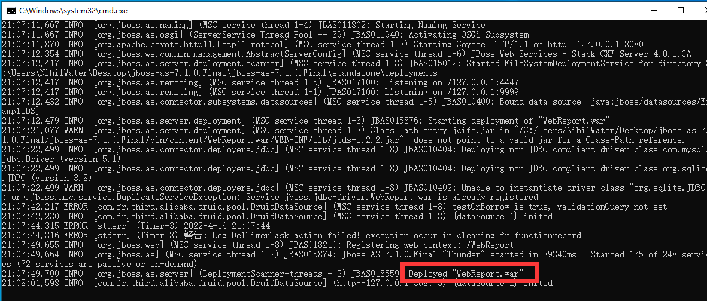

当看到以上内容就说明部署完成了。访问浏览器8080端口得到如下内容。

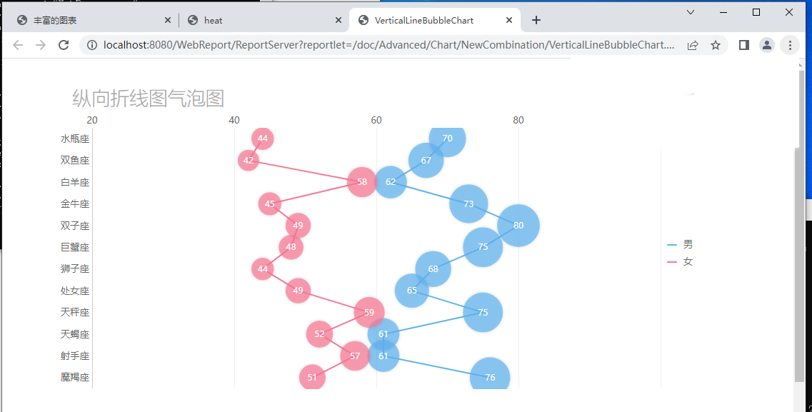
