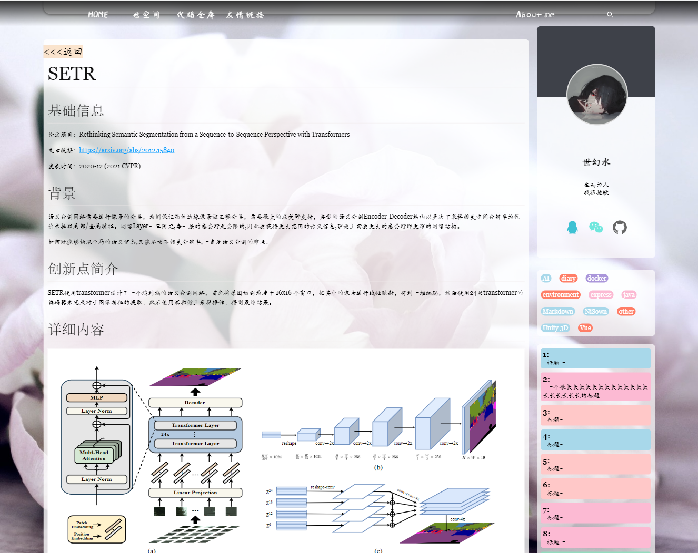
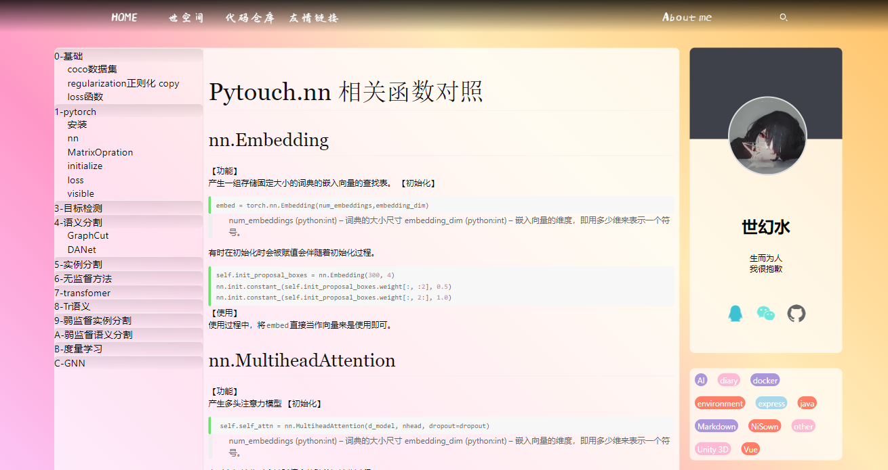

# NiWeb

## 主要思想

   React 以其组件化的思想，为大家提供了良好的编程体验，在我们编写自己的博客时，如果能很好的使用这种编程逻辑，我们就可以写出更加灵活的，可扩展性强的博客。如果你也是这么想的，请和我一起发展这个项目吧。与Hexo相比，React在生成静态界面的同时，保留了react 特有的虚拟dom 和 diff 算法，让你博客的响应速度出人一等。

## 主要板块

    经过作者的长期观察，一般的博客网站可以划分为一下几个结构
    1. 首页
        1.0 导航栏
        1.1 首页的大图，这一部分，往往博主会放一张图片和一些文字，来提升博客整体的丰富度
        1.2 首页的文章列表，文章列表主要是文章的访问数据，标题，描述和配图
        1.3 首页的底部, 在中国的网站至少会有备案信息
    2. 文章展示

    3. 历史档案

## 页面展示

【首页布局】

【单文页面】

【主题阅读】

## 更新说明

- 2021 年 3 月 7 日：完成前端首页整体布局

    可以通过访问[https://nihilwater.github.io/](https://nihilwater.github.io/) 进行访问

- 2022 年 2 月 5 日：react 版本更新

- 2022 年 2 月 11 日：markdown 后端更新
    可以使用 `npm run parse` 命令将 `/public/markdown` 文件里的文件转化到成 json 数据和 html。

- 2022 年 3 月 25 日：加入私有空间
    将本仓库作为私有的仓库，文章如果以_private.md为结束的，都将被视为私有的文章，不会被发布到个人仓库。
    再本地使用是，可以通过 `npm run parse`将所有文件全部展示出来

## 版权

    这套前端，我将完全的开源出去，免费商用！！，欢迎大家可以一起来丰富它，如果觉得有用，点一个星星吧。

## 问题&回答

【npm install 报错】
