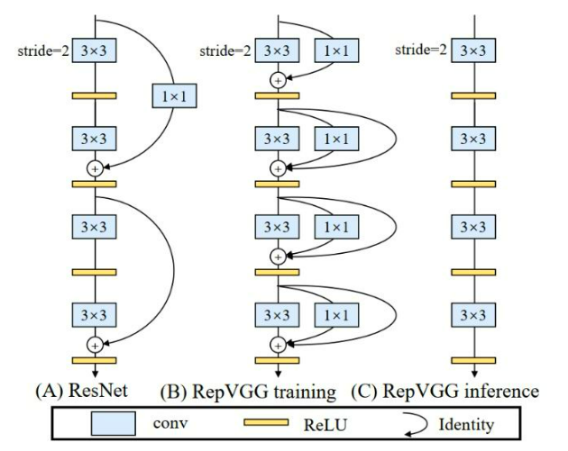

# CV_trick

## 数据源改进

1. **噪音数据删除**
   
   （最大熵删除法、cleanlab等）

2. **mix-up**
   
   主要思路是在训练数据中抽取两个样本，构造混合样本和混合标签，用于新的增广数据。直观的看，其实就是希望模型输入未另外两个输入的线性组合时，输出也是各自输出的线性组合，即希望模型近似未一个线性系统，来防止过拟合。

3. **对抗学习**
   
   对抗训练的概念就是在原始输入样本上加一个扰动，得到对抗样本后，用其进行训练。常见的有FGM,PGD等策略，一般是比较稳定提分的方法。

   例如CV领域可以给图片加入噪声。

## 训练技巧

1. 初始化技巧
   尝试模型初始化方法，不同的分布，分布参数。下图是用不同初始化方法网络性能对比，有兴趣的同学可以看看kaiming的论文Delving Deep into Rectifiers: Surpassing Human-Level Performance on ImageNet Classification 。

2. Dropout层
   Dropout层，由Geoffrey Hinton两年前在一篇开创性的论文中提出，Dropout函数能减弱过拟合效应。

## 学习率优化
1. **warm up**

   warmup cosine lr scheduler ， 先热身（学习率逐渐攀升），再进行余弦衰减，对大模型这个学习率策略非常好用，在huggingface Transformers 库已经有现成的。
   

2. **带重启的SGD算法**

   梯度下降算法可以通过突然提高学习率，来“跳出”局部最小值并找到通向全局最小值的路径。这种方式称为带重启的随机梯度下降方法（stochastic gradient descent with restarts, SGDR），这个方法在Loshchilov和Hutter的ICLR论文中展示出了很好的效果。[SGDR: Stochastic Gradient Descent with Warm Restarts](https://arxiv.org/abs/1608.03983)

## loss 函数
1. **正负样本均衡**
   Focal Loss: 通过设计平衡因子，完成正负样本均衡，以及偏向对困难样本的训练  
   > $\alpha$表示了正负样本的均衡，如果$\alpha$越大，则Loss对于正样本越敏感。
   > $\gamma$表示了对错误分类的惩罚力度，如果$\gamma$越大，则对于预测不准的惩罚力度会更大，而对那些预测比较准的惩罚较少，当$\gamma=0$时，Loss函数对于预测准和不准的样本采用线性的惩罚措施。
$$ L_{fl}=\left\{
\begin{array}{rcl}
-\alpha (1-y)^{\gamma}log(y')      &      & \text{y=1(T)}\\
-(1-\alpha )(y')^{ \gamma }log(1-y')  &      & \text{y=0(F)}
\end{array} \right. $$

2. **AWP对抗训练**

   AWP通过将最坏的情况扰动加入到DNN中来显式地平坦化权重损失函数。要同时关注训练鲁棒性和鲁棒泛化误差。

## 效率方面
   1. 模型蒸馏
   
   2. 结构冲参数化
   使用复杂模型进行训练，然后将模型参数转化为等价且运算量小的形式。例如将 VGG 式模型中的每一个 3*3 卷积层添加一个并行的 1*1 卷基层和恒等快捷连接（identity shortcut connection）。这种修改后的 VGG 模型在训练时具备多分支模型的优秀性质，得到较好的训练效果。在推理时，我们可以通过结构重参数化方法将修改后的 VGG 式模型转化为相应的单分支结构，实现较高的推理效率。

   

   

