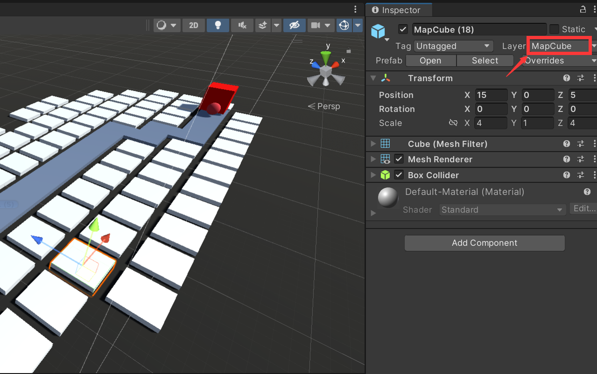

# unity 点击事件

对于 3d 场景下物品的点击，需要使用到射线方法。

## 多个重复对象的点击方法

【1. 添加Layer】<br />
给这些重复的物品添加相同的Layer, 这步最好在物品复制之前完成。


```c
private void Update()
{
    if (Input.GetMouseButtonDown(0)) {
        if (EventSystem.current.IsPointerOverGameObject() == false) {
            Ray ray = Camera.main.ScreenPointToRay(Input.mousePosition);
            RaycastHit hit;
            bool isCollider = Physics.Raycast(ray,out hit,  1000, LayerMask.GetMask("MapCube"));
            if (isCollider) {
                GameObject mapCube = hit.collider.gameObject;  // 得到点击的 mapCube
            }
        }
    }
}
```
