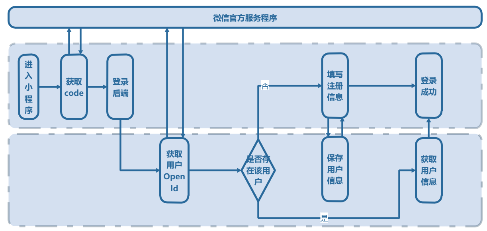

# 微信小程序用户登录一般流程

## 流程图



## 获取用户OpenId
上文中说过OpenId是微信用户在小程序里的唯一识别码，获取了它，就等于有了用户Id，以方便之后用户敏感的所有操作。那么如何去获取它呢？

微信提供`wx.login`方法来获取一个叫做`code`的东西，通过`code` + `微信小程序密钥`，来对`https://api.weixin.qq.com/sns/jscode2session` 发起请求，就可以获取用户的`openId`了。

```js
// 调用 wx.login 获取用户 code
wx.login({
  success: function (res) {
     console.log(res.code)
  }
})
```

通过以上代码可以放到app的onload方法中，打开小程序就取得用户的code，下一步就需要将code发送给后端服务程序。获取用户的OpenId了。
【前端代码】
```js
// 获取用户openid
getOpenid: function () {
  let that = this
  wx.login({
    success: function (res) {
      console.log(res.code)
      wx.request({
        method:"POST",
        // 这里填写用于自己后台用户登录的地址
        url: that.globalData.baseURL + "/auth/login",
        data: res.code,
        success: function (res) {
          if (res.data.code === "200"){
            console.log(res.data.data)
          }
        },
        fail: function (err) {
          console.log(err)
        }
      })
    }
  })
},
```

【后端代码java为例，service层】
```java
// 输入为前端所传来的用户code
public Map<String, Object> login(String code) {
    // **1**.向微信服务器发起请求，获取用户信息
    // ConstantConfig.getSessionKeyUrl = "https://api.weixin.qq.com/sns/jscode2session" 
    // ConstantConfig.appId 小程序appId  ：
    //    公众平台设置 -> 开发管理 -> 开发设置 -> appId
    // ConstantConfig.appId 小程序secret ：
    //    公众平台设置 -> 开发管理 -> 开发设置 -> 生成AppSecret
    // ConstantConfig.grantType = "JSAPI" 小程序为JSAPI
    String url = ConstantConfig.getSessionKeyUrl
                + "?appid=" + ConstantConfig.appId 
                + "&secret=" + ConstantConfig.secret 
                + "&js_code=" + code 
                + "&grant_type=" + ConstantConfig.grantType;
    JSONObject httpResult = HttpUtils.httpGet(url);

    // **2**.收到数据，判断是否有错
    Map<String, Object> result = new HashMap<>();
    String openid = "";
    String skey;
    if (httpResult.get("errcode") != null) {
        result.put("errcode", httpResult.get("expires_in"));
    } else {
        // **3**.微信服务器传回有效数据，判断用户登录状态是否过期，没有就刷新一下状态
        openid = httpResult.get("openid").toString();
        skey = httpResult.get("session_key").toString();
        if (openid == null) {
            result.put("code", "400");
            return result;
        }
    }
    // **4**. 返回用户 openid
    result.put("code", "200");
    result.put("openid", openid);
    return result;
}
```


